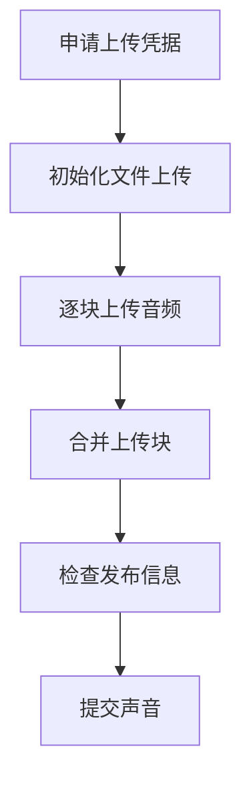

# 播客上传声音

先上传音频文件，再提交声音所属播客、封面和分类等信息。使用具有发布权限的登录 Cookie，不能只调用一个空的 `voiceUpload()`。

## 接口信息

| 项目     | 值                   |
| -------- | -------------------- |
| 接口地址 | `/voice/upload`      |
| 上传方式 | POST multipart       |
| 身份要求 | 有发布权限的登录身份 |
| 对应模块 | `voice_upload`       |

## 请求参数

`songFile` 是上传所需的文件。其余发布信息按目标播客和上游要求填写，当前本地输入解码不会替上游完整验证发布规则。

| 参数               | 类型                     | 说明                                                    |
| ------------------ | ------------------------ | ------------------------------------------------------- |
| `songFile`         | HTTP 文件或 SDK 文件对象 | 音频字节，SDK 对象含 `data`、`name`、`mimetype`、`size` |
| `voiceListId`      | number 或 string         | 所属播客 ID                                             |
| `coverImgId`       | number 或 string         | 封面图片 ID                                             |
| `categoryId`       | number 或 string         | 分类 ID                                                 |
| `secondCategoryId` | number 或 string         | 子分类 ID                                               |
| `description`      | string                   | 声音介绍                                                |
| `songName`         | string                   | 声音名称，未提供时从文件名整理                          |
| `privacy`          | 布尔值或相应数字、字符串 | 是否为隐私声音，示例配置可用 `1` 或 `0`                 |
| `publishTime`      | number 或数字字符串      | 定时发布时间，未设置时发送 `0`                          |
| `autoPublish`      | 布尔值或相应数字、字符串 | 是否发布动态，建议传 `1` 或 `0`                         |
| `autoPublishText`  | string                   | 动态文案，默认空字符串                                  |
| `orderNo`          | number 或数字字符串      | 排序，默认 `1`                                          |
| `composedSongs`    | string                   | 包含的歌曲 ID，用逗号分隔                               |

## HTTP 示例

先准备 MP3 文件，并替换示例中的发布信息：

```bash
curl 'http://127.0.0.1:3021/voice/upload' \
  -H 'Cookie: MUSIC_U=your-cookie' \
  -F 'songFile=@./episode.mp3;type=audio/mpeg' \
  -F 'voiceListId=your-voice-list-id' \
  -F 'coverImgId=your-cover-id' \
  -F 'categoryId=your-category-id' \
  -F 'secondCategoryId=your-subcategory-id' \
  -F 'description=本期声音介绍'
```

## 编程式调用

```ts
import { readFile } from 'node:fs/promises';
import { voiceUpload } from 'hana-music-api';

const data = await readFile('./episode.mp3');
const result = await voiceUpload(
  {
    songFile: {
      data,
      name: 'episode.mp3',
      mimetype: 'audio/mpeg',
      size: data.byteLength,
    },
    voiceListId: 'your-voice-list-id',
    coverImgId: 'your-cover-id',
    categoryId: 'your-category-id',
    secondCategoryId: 'your-subcategory-id',
    description: '本期声音介绍',
    songName: '第一期',
  },
  { cookie: 'MUSIC_U=your-cookie' },
);
console.log(result.body);
```

## 分块上传和部分完成



内部按最多 10 MiB 一块传输，但这不会绕过 HTTP 服务默认 10 MiB 的入站文件总量限制。通过 HTTP 上传更大文件时，需要调整服务配置，见 [部署 HTTP 服务](/guide/server-deployment)。

每个阶段最多 60 秒，整个上传模块最多 5 分钟，调用方可以设置更短的总期限。已经完成的上游阶段无法回滚；失败时的 `partialCompletion` 和数字 `completedStages` 表示部分阶段已完成，不代表声音已经发布成功。再次上传前先确认上游结果，避免重复提交。
