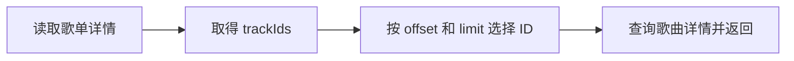

# 获取歌单中的歌曲

这个模块先读取歌单详情中的 `trackIds`，选出指定范围的 ID，再请求这些歌曲的详情。一次调用包含两次上游读取，共用同一次调用的身份和总期限。



## 接口信息

| 项目     | 值                                                       |
| -------- | -------------------------------------------------------- |
| 接口地址 | `/playlist/track/all`                                    |
| 请求方式 | GET / POST                                               |
| 需要登录 | 公开歌单可尝试游客调用，实际可见范围取决于权限和上游返回 |
| 对应模块 | `playlist_track_all`                                     |

## 请求参数

| 参数     | 类型                | 必填 | 默认值 | 说明                                 |
| -------- | ------------------- | ---- | ------ | ------------------------------------ |
| `id`     | number 或 string    | 是   | 无     | 歌单 ID                              |
| `limit`  | number 或数字字符串 | 否   | `1000` | 本次选择的歌曲数                     |
| `offset` | number 或数字字符串 | 否   | `0`    | 从第几个 ID 开始，按零起算           |
| `s`      | number 或数字字符串 | 否   | `8`    | 传给上游歌单详情请求的收藏者数量参数 |

比如 `limit=50&offset=0` 选择前 50 首，`limit=50&offset=50` 选择接下来的 50 首。当前实现不会自动循环到歌单末尾，超过 1000 首时应继续分页。

## HTTP 示例

```bash
curl 'http://127.0.0.1:3021/playlist/track/all?id=24381616&limit=50&offset=0'
```

## 编程式调用

```ts
import { playlistTrackAll } from 'hana-music-api';

const result = await playlistTrackAll(
  { id: '24381616', limit: 50, offset: 0 },
  { cookie: 'MUSIC_U=your-cookie' },
);
console.log(result.body);
```

能查到哪些歌曲，取决于上游返回的 `trackIds` 和当前身份权限。接口名中的“全部”不保证游客能读取完整歌单，也不表示一次返回任意数量的歌曲。
