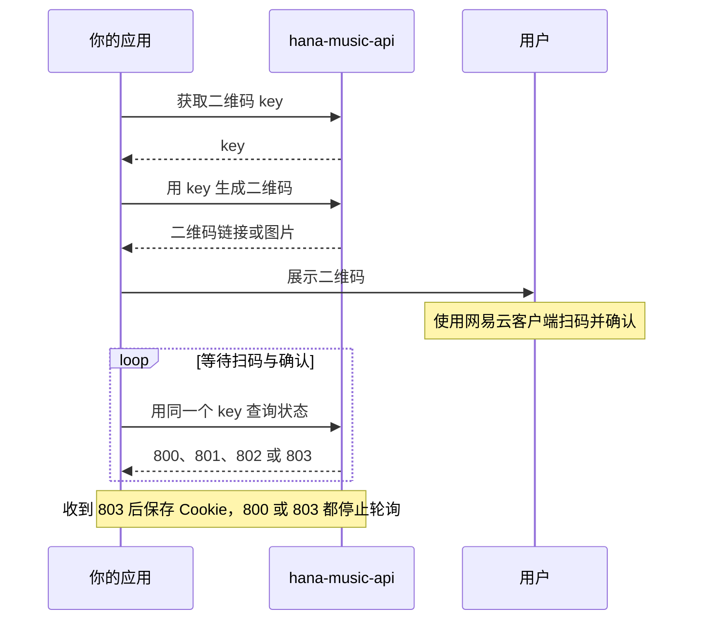

# 认证机制

搜索、歌词等接口可以用游客身份调用。账户信息、歌单管理、云盘、私信等操作通常需要有效的登录 Cookie。

## 选择登录方式

| 方式       | 接口                                                   | 提供什么                                    |
| ---------- | ------------------------------------------------------ | ------------------------------------------- |
| 手机号登录 | `/login/cellphone`                                     | `phone`，以及密码、MD5 密码或验证码中的一种 |
| 邮箱登录   | `/login`                                               | 邮箱与密码，或 MD5 密码                     |
| 二维码登录 | `/login/qr/key`、`/login/qr/create`、`/login/qr/check` | 先获取 key，再生成二维码并查询扫码状态      |
| 游客身份   | `/register/anonimous`                                  | 获取匿名 Cookie，不能代替账号登录           |

这些是库支持的调用形式，实际是否能登录仍取决于网易云的验证和账号状态。不要为了每次读数据都重新登录，优先复用已有 Cookie。

## 二维码登录的先后顺序



| 业务 `code` | 应用下一步做什么                                       |
| ----------- | ------------------------------------------------------ |
| `800`       | 二维码已过期，停止轮询并重新获取 key                   |
| `801`       | 等待扫码                                               |
| `802`       | 已扫码、等待用户确认，可以显示正文里扫码人的昵称和头像 |
| `803`       | 登录成功，保存 Cookie 并停止轮询                       |

这些状态通过 `body.code` 区分，不能只看 SDK 的 `status` 或 HTTP 状态码。网易云要求行为验证（`8821`）等其他业务码会让 Promise 拒绝。登录相关模块的返回体类型和结构定义见 [返回体结构](/guide/response-bodies)。使用仓库服务时，可打开 `/demo/qr-login` 查看现有示例。

登录和二维码轮询不走库内的读缓存，无需靠 `timestamp` 绕过它。若部署环境还有 CDN、浏览器或反向代理缓存，应单独检查那一层的缓存规则。

## 登录成功后保存 Cookie

SDK 响应的顶层 `cookie` 是字符串数组。部分登录模块还会在 `body.cookie` 中提供拼接后的字符串。client 不会自动把登录结果写回默认配置，需要由调用方保存并用于后续请求。

```ts
import { createHanaMusicApi, loginCellphone } from 'hana-music-api';

const loginResult = await loginCellphone({
  phone: 'your-phone-number',
  captcha: 'your-captcha',
});

const cookie = loginResult.cookie.join('; ');
const hana = createHanaMusicApi({ cookie });
const account = await hana.userAccount({});

console.log(account.body);
```

上例用于演示验证码登录成功后的衔接，实际应用还应处理登录失败和 Cookie 过期。网易云的风控可能拦下手机号登录（`10004`），处理方式见 [手机号登录](/api/user/login-cellphone)。保存 Cookie 后无需保留登录密码；两种登录方式得到的 Cookie 都可以用 [刷新登录](/api/user/login-refresh) 续期。

单独调用函数时，把认证信息放在第二个参数：

```ts
import { userAccount } from 'hana-music-api';

const result = await userAccount({}, { cookie: 'MUSIC_U=your-cookie' });
console.log(result.body);
```

## HTTP 怎样传 Cookie

HTTP 服务支持请求头 `Cookie`，也保留 query 或 body 中的 `cookie` 字段。后者的覆盖规则见 [调用约定](/guide/request-convention)。

服务会把接口返回的 Cookie 写入响应的 `Set-Cookie`。跨域浏览器调用还需要 `credentials: 'include'`，并满足浏览器的 Cookie 和 HTTPS 规则。

`noCookie=true` 只阻止服务向响应写入 `Set-Cookie`，不会清空本次请求已有的登录身份，也不会关闭缓存。

## 游客身份从哪里来

SDK 未收到有效身份、进程中也没有可用匿名令牌时，会在首次需要时注册游客身份。提供了 `MUSIC_U`、`MUSIC_A` 或 `state.anonymousToken` 时，优先使用这份身份。

游客身份不能访问需要账号权限的接口。遇到需要登录的响应时，先确认 Cookie 是否有效、是否被本次配置覆盖，再检查请求的接口要求。身份选择细节见 [运行时状态与身份](/guide/runtime-identity)。
