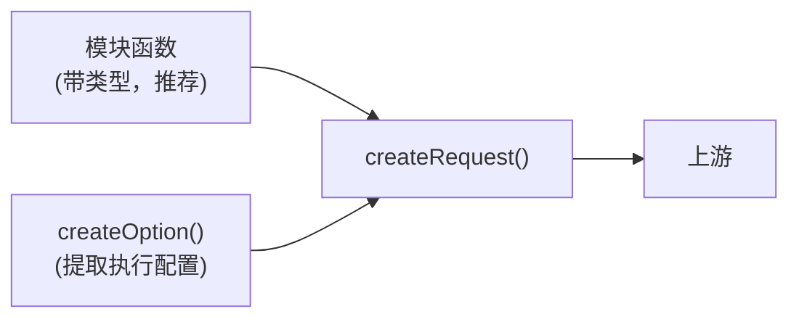

# 直接使用请求原语

如果某个上游接口还没有对应的模块，或者想完全自己掌控请求，可以直接使用请求原语：`createRequest()` 和 `createOption()`。

## `createRequest()`

这是请求层的核心函数，模块函数最终都会调用它。

```ts
function createRequest(
  uri: string,
  data: Record<string, unknown>,
  options?: CreateRequestOptions,
): Promise<NcmApiResponse>
```

- `uri`：上游接口路径，约定以 `/api/...` 开头。
- `data`：发给上游的业务数据（加密前的明文对象）。
- `options`：执行配置，参考 [执行配置完整参考](/guide/config-reference)。

返回的是统一的 `NcmApiResponse`：

```ts
interface NcmApiResponse<TBody = unknown> {
  body: TBody // 解密、归一化后的响应体
  cookie: string[] // 上游下发的 Set-Cookie
  status: number // 归一化后的状态码
}
```

### 例子：直接调搜索接口

```ts
import { createRequest } from 'hana-music-api'

// 等价于 search({ keywords: '周杰伦', limit: 5 })
const res = await createRequest(
  '/api/search/get',
  {
    s: '周杰伦',
    type: 1,
    limit: 5,
    offset: 0,
  },
  {
    crypto: 'eapi', // 不传则默认 eapi
    cookie: 'MUSIC_U=your-cookie',
  },
)

console.log(res.body)
```

`uri` 会根据 `crypto` 被改写成最终 URL（比如 eapi 下 `/api/search/get` → `interface.music.163.com/eapi/search/get`）。

### 什么时候用 `createRequest()`

- 某个上游接口还没有现成模块，想临时调一下。
- 在做调试、抓包对照，需要逐字段控制请求。
- 在封装自己的模块层，想复用底层加密 / 重试 / 解密能力。

日常业务调用优先用模块函数，它带类型和参数提示，也处理了各接口的参数差异。`createRequest()` 用于没有现成模块的情况，不是默认选择。

## `createOption()`

```ts
function createOption(
  query: ModuleQuery & OptionSource,
  crypto?: RequestCrypto,
): CreateRequestOptions
```

`createOption()` 的作用是从一个**混在一起的 query 对象**里，
把执行配置字段（`cookie`、`proxy`、`crypto`、`retry`、`timeoutMs`……）摘出来，
整理成 `createRequest()` 能消费的 `options`。

这正是模块内部在做的事。回看 banner 模块：

```ts
// src/modules/banner.ts 的核心一行
request('/api/v2/banner/get', { clientType: type }, createOption(query))
```

模块拿到的 `query` 里既有业务参数（`type`），也可能夹带执行配置（`cookie`、`proxy` 等）。`createOption(query)` 负责把后者提取出来。

### 什么时候用 `createOption()`

绝大多数情况用不到。它主要服务于模块内部，以及与旧项目“query 里混着执行参数”的兼容。只有当你也按同样的约定接收一个扁平的 query 对象、需要复用这套提取逻辑时，才会直接调它。

如果是从头写调用，更推荐直接构造 `options` 对象传给 `createRequest()`，类型更清晰。

## 小结


