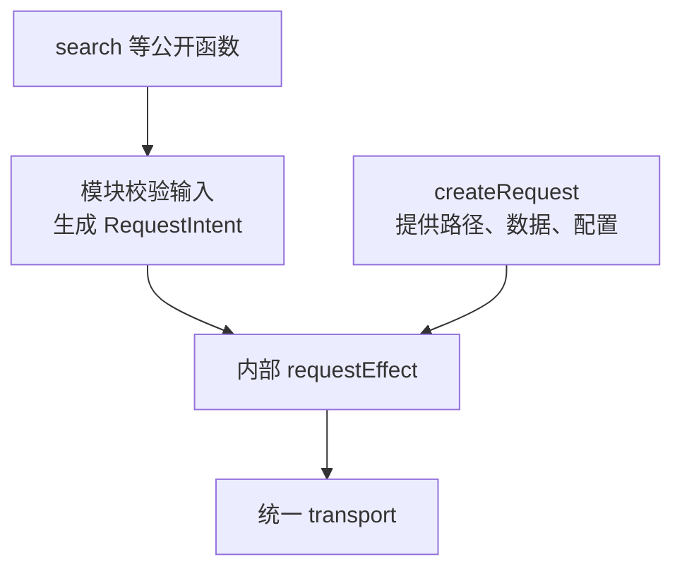

# 直接使用底层请求

某个上游接口还没有现成模块时，可以用 `createRequest` 提供上游路径和数据。它返回 Promise，并复用内部请求内核的加密、限流、期限和响应处理。

## 最小调用

```ts
import { createRequest } from 'hana-music-api';

const result = await createRequest(
  '/api/search/get',
  { s: '海阔天空', type: 1, limit: 5, offset: 0 },
  { crypto: 'eapi', cookie: 'MUSIC_A=your-anonymous-token' },
);

console.log(result.status, result.body, result.cookie);
```

| 参数      | 提供什么                                                       |
| --------- | -------------------------------------------------------------- |
| `uri`     | 以 `/api/` 开头的上游逻辑路径                                  |
| `data`    | 加密前的业务数据对象，字段名应符合上游要求                     |
| `options` | Cookie、协议、代理、期限等 [执行配置](/guide/config-reference) |

示例使用了搜索的上游参数 `s`。公开 `search` 模块则接收 `keywords`，再替你做转换。底层请求没有这一步，也不会自动执行 SDK 的游客注册或模块级缓存，因此不能把两者当成完全等价的调用。

返回值仍是 `{ status, body, cookie }`，执行失败通过 Promise 拒绝交给调用者，见 [返回值与错误](/guide/programmatic-api#返回值与错误)。

## 它与模块请求的关系


```mermaid
flowchart TD
  SDK["search 等公开函数"] --> MODULE["模块校验输入<br/>生成 RequestIntent"]
  MODULE --> CORE["内部 requestEffect"]
  DIRECT["createRequest<br/>提供路径、数据、配置"] --> CORE
  CORE --> TRANSPORT["统一 transport"]
```

模块通过 `RequestCapability` 提交请求意图，默认实现是 `requestEffect`。它们不会绕到公开的 Promise 函数 `createRequest` 再执行一次。

`createRequest` 专用于这类 API 协议请求，不是任意 URL 的代理。路径和最终目标仍要通过检查，携带身份时只允许已知 HTTPS 网易云 API 域名。

## createOption 做什么

`createOption` 保留了从扁平对象提取执行配置的能力。它会整理 Cookie、协议、超时等已知字段，不会发送请求，也不会检查某个接口的业务参数。

```ts
import { createOption, createRequest } from 'hana-music-api';

const legacyInput = {
  keywords: '海阔天空',
  cookie: 'MUSIC_A=your-anonymous-token',
  timeoutMs: '5000',
};

const options = createOption(legacyInput, 'eapi');
const result = await createRequest(
  '/api/search/get',
  { s: legacyInput.keywords, type: 1, limit: 5, offset: 0 },
  options,
);
console.log(result.body);
```

第二个参数为协议默认值，对象里的有效 `crypto` 字段优先。仓库中部分模块也保留这个 helper 来构造协议选项，再转换成请求意图；实际执行配置仍来自本次调用的配置快照。

新写的 SDK 调用直接把业务参数和配置分开即可，不必先混进一个对象再提取。`createOption` 主要用于接入已有的扁平参数约定。
