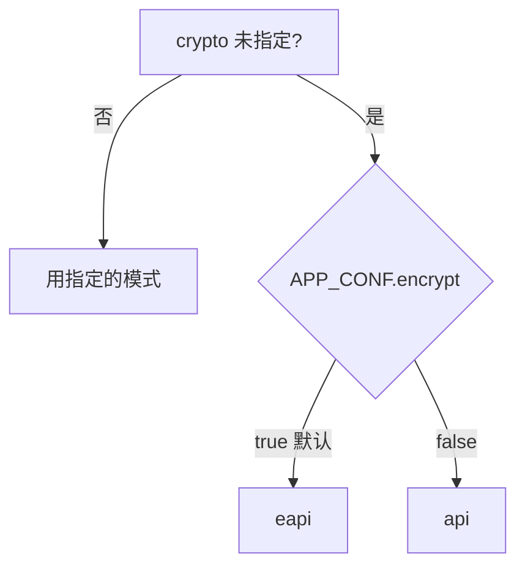

# 加密模式

网易云的上游接口不是普通的 REST，请求体要加密，部分响应也要解密。`hana-music-api` 把这套逻辑封装在请求层里，对外只暴露一个开关：`crypto`。

大多数情况下不用管它，模块会自己选好。绕过模块层、或某个接口换通道后调不通时，才需要了解这四种模式。

## 四种模式

| 模式 | 上游通道 | 加密方式 | 典型用途 |
| --- | --- | --- | --- |
| `weapi` | `music.163.com/weapi/*` | AES-128-CBC 双层 + RSA | 网页端接口，登录、部分公开数据。 |
| `eapi` | `interface.music.163.com/eapi/*` | AES-128-ECB + 摘要校验 | 客户端接口，覆盖面最广，支持加密响应。 |
| `api` | `interface.music.163.com/*` | 不加密请求体 | eapi 的明文变体，少数接口用。 |
| `linuxapi` | `music.163.com/api/linux/forward` | AES-128-ECB 转发 | Linux 客户端伪装通道。 |

每种模式还会自动带上匹配的 `User-Agent`（网页端 / iPhone / Linux），一般不需要手动覆盖 `ua`。

## 默认怎么选

不传 `crypto` 时，请求层按一个全局开关决定：



默认配置下 `encrypt` 是开启的，所以**不传 `crypto` 就走 `eapi`**。

模块函数在迁移时各自固定了自己该用哪种模式，所以正常调用接口时看不到这个选择过程。只有在 [直接使用请求原语](/guide/create-request-and-create-option) 时，才需要自己决定传哪种。

## 加密响应：`e_r`

部分 `eapi` / `weapi` 接口可以让上游返回**加密的二进制响应**，而不是明文 JSON。是否启用由 `e_r` 控制：

- `e_r` 为真：请求层会把上游返回的二进制按十六进制解密成 JSON，再返回。
- `e_r` 为假（默认）：按普通 JSON 解析。

```ts
import { createRequest } from 'hana-music-api'

const res = await createRequest(
  '/eapi/some/endpoint',
  { id: 123 },
  { crypto: 'eapi', e_r: true },
)
```

解密只对 `eapi` 和 `weapi` 生效。其它模式即使传了 `e_r`，也只是把它当成普通参数发给上游。

> 这部分行为对齐了旧项目：eapi 和 weapi 两种加密响应现在都能正确解密。从旧实现迁移过来若发现 weapi 响应解不出，通常就是这个修复点。

## gzip 压缩响应：`acceptGzip`

真实客户端在请求 `eapi` 时会声明自己能接受 gzip 压缩的响应，以节省带宽。可以用 `acceptGzip` 打开同样的行为：

```ts
const res = await createRequest(
  '/eapi/some/large/list',
  { id: 123 },
  { crypto: 'eapi', e_r: true, acceptGzip: true },
)
```

开启后请求层会带上 `x-aeapi: true` 头，并在解密阶段先 gunzip 再解析。**只对 `eapi` 有意义**，返回数据量大的列表类接口收益明显。

## 反作弊 token：`checkToken`

少数 `eapi` / `api` 接口需要在请求头里带一个反作弊 token。用 `checkToken` 开启：

```ts
const res = await createRequest(
  '/eapi/some/protected',
  { id: 123 },
  { crypto: 'eapi', checkToken: true },
)
```

token 内容由请求层内置，只需要决定开不开。不需要时保持默认关闭即可，避免给普通接口带上无谓的字段。

## 底层实现是内部细节

`crypto` 和上面这些字段都是请求层的开关，**底层加解密实现是内部细节**，不需要也不应该直接 import `crypto.ts` 里的函数。
