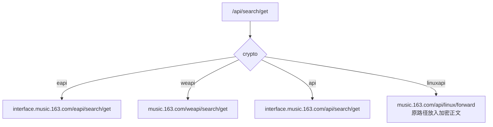

# 加密模式

网易云不同接口使用不同的请求协议。模块已经选择了默认协议，正常调用搜索、登录等方法时，通常不需要自己设置 `crypto`。

## 四种模式

| 模式       | 默认上游通道                      | 请求体处理               |
| ---------- | --------------------------------- | ------------------------ |
| `weapi`    | `music.163.com/weapi/*`           | 双层 AES-128-CBC 与 RSA  |
| `eapi`     | `interface.music.163.com/eapi/*`  | AES-128-ECB 与摘要校验   |
| `api`      | `interface.music.163.com/api/*`   | 表单数据，不加密请求体   |
| `linuxapi` | `music.163.com/api/linux/forward` | AES-128-ECB 加密转发数据 |

请求层还会匹配协议所需的 Cookie 和 `User-Agent`。这些是网易云协议适配，不是一个普通 JSON HTTP 客户端的开关集合。

## 模块默认值与底层默认值

调用模块时，以模块选择的协议为默认值，比如手机号登录使用 `weapi`。显式 `config.crypto` 可以覆盖 API 请求协议，但换协议不保证接口仍可用。

直接调用 `createRequest` 时，没有模块帮你选择。不传 `crypto` 或传空字符串，当前内置配置会选择 `eapi`。内部 `APP_CONF.encrypt` 关闭时才会回退为 `api`，它不是根 SDK 提供的全局设置接口。

## 路径始终传 /api/

底层请求接收逻辑路径 `/api/...`，再根据 `crypto` 生成真正发送的 URL。不要把已经转换好的 `/eapi/...` 或 `/weapi/...` 传回 `createRequest`，这会在发送前失败。


```mermaid
flowchart TD
  PATH["/api/search/get"] --> MODE{"crypto"}
  MODE -->|eapi| EAPI["interface.music.163.com/eapi/search/get"]
  MODE -->|weapi| WEAPI["music.163.com/weapi/search/get"]
  MODE -->|api| API["interface.music.163.com/api/search/get"]
  MODE -->|linuxapi| LINUX["music.163.com/api/linux/forward<br/>原路径放入加密正文"]
```

```ts
import { createRequest } from 'hana-music-api';

const result = await createRequest(
  '/api/search/get',
  { s: '海阔天空', type: 1, limit: 5, offset: 0 },
  { crypto: 'eapi', cookie: 'MUSIC_A=your-anonymous-token' },
);
console.log(result.body);
```

日常搜索仍优先用 `search`，因为它还负责业务参数转换和 SDK 身份初始化。

## 加密响应和 gzip

`e_r` 表示请求上游返回加密响应，默认关闭。请求层会先尝试解析普通 JSON；遇到非 JSON 正文，且使用 `eapi` 或 `weapi` 并启用了 `e_r` 时，才尝试解密。

`acceptGzip` 为 `eapi` 增加 `x-aeapi: true`，并在加密响应处理时按 gzip 格式解压。处理顺序是先解密、再解压、最后解析 JSON。


```mermaid
flowchart LR
  BYTES["加密响应字节"] --> DECRYPT["解密"]
  DECRYPT --> GZIP["启用 gzip 时解压"]
  GZIP --> JSON["解析 JSON"]
```

这两个选项应与目标接口实际返回的格式匹配。它们不会让任意接口自动支持加密或压缩响应。普通模块调用沿用现有默认值即可。

`crypto`、`e_r` 和 `acceptGzip` 的类型见 [配置参考](/guide/config-reference)。加解密函数和协议常量属于内部实现，不应通过包内部路径导入。
