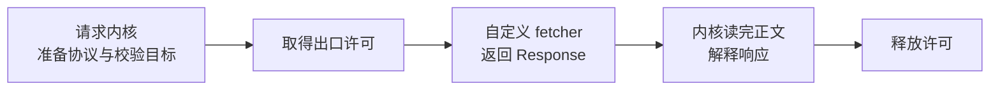

# 自定义 fetcher

需要替换底层 HTTP 实现、记录网络请求或接入测试桩时，可以传 `fetcher`。普通调用直接使用默认实现即可。

## 最小实现

`FetchLike` 与标准 `fetch` 使用相同的签名：

```ts
import { createHanaMusicApi, type FetchLike } from 'hana-music-api';

const customFetcher: FetchLike = (input, init) => fetch(input, init);
const hana = createHanaMusicApi({ fetcher: customFetcher });

const result = await hana.search({ keywords: '海阔天空' });
console.log(result.body);
```

`createHanaMusicApi`、具名函数、`invokeModule` 和 `createRequest` 都能接收这个字段。它替换的是发送请求的实现，目标检查、加密、流量控制和响应解释仍由请求内核负责。



## 取消信号要继续传下去

使用 `fetch(input, init)` 时，`init.signal` 会一起传入。如果在中间重新构造配置，也要保留这个信号，并让返回的正文流支持取消。

自定义实现返回 `Response` 时，内核还没有结束工作。响应正文读取也在总期限内。超时或取消时，库能释放自己的许可，但无法强制停止一个忽略信号、私下继续联网的第三方实现。

内核传入 `redirect: 'manual'`，自定义实现也应遵守它，不要自行跟随重定向绕过目标检查。

## 代理怎样配置

简单 HTTP 代理直接用 `proxy`：

```ts
import { search } from 'hana-music-api';

const result = await search(
  { keywords: '海阔天空' },
  { proxy: 'http://127.0.0.1:7890' },
);
console.log(result.body);
```

Bun 默认传输使用原生代理支持，Node.js 使用 undici 的 `ProxyAgent`。代理不可用时不会静默改成直连。

`proxy` 不支持 PAC，且不能与自定义 `fetcher` 同时传入。需要 SOCKS、mTLS 或自己的连接池时，由自定义实现选择支持这些能力的网络客户端，并负责其连接资源的生命周期。仅仅包装默认 `fetch` 不会自动获得这些能力。

## 记录收到响应头的时间

```ts
import { createHanaMusicApi, type FetchLike } from 'hana-music-api';

const loggingFetcher: FetchLike = async (input, init) => {
  const url = new URL(input instanceof Request ? input.url : String(input));
  const startedAt = performance.now();
  const response = await fetch(input, init);

  console.log({
    target: `${url.origin}${url.pathname}`,
    status: response.status,
    headersReceivedMs: performance.now() - startedAt,
  });
  return response;
};

const hana = createHanaMusicApi({ fetcher: loggingFetcher });
await hana.search({ keywords: '海阔天空' });
```

这个耗时通常截止到响应头到达，不包含内核随后读取正文的时间。日志也刻意省略 query、请求头和正文。需要观察重试或统计整次调用时，见 [调试与可观测性](/guide/observability)。

## 用假响应测试调用

```ts
import { expect, test } from 'bun:test';
import { songUrl, type FetchLike } from 'hana-music-api';

const stub: FetchLike = async () => Response.json({ code: 200, data: [] });

test('songUrl 使用假响应', async () => {
  const result = await songUrl(
    { id: '1' },
    { fetcher: stub, cookie: 'MUSIC_A=test-token' },
  );
  expect(result.status).toBe(200);
});
```

身份注册同样经过 `fetcher`。上例显式传入测试身份，避免额外触发游客注册。如果要测试注册过程，假响应应包含有效的 `MUSIC_A` Cookie。

假的 `Response` 也会经过正文解释，普通 JSON 的未知字段会保留。它适合验证本地请求逻辑，不能证明真实网易云接口可用。
