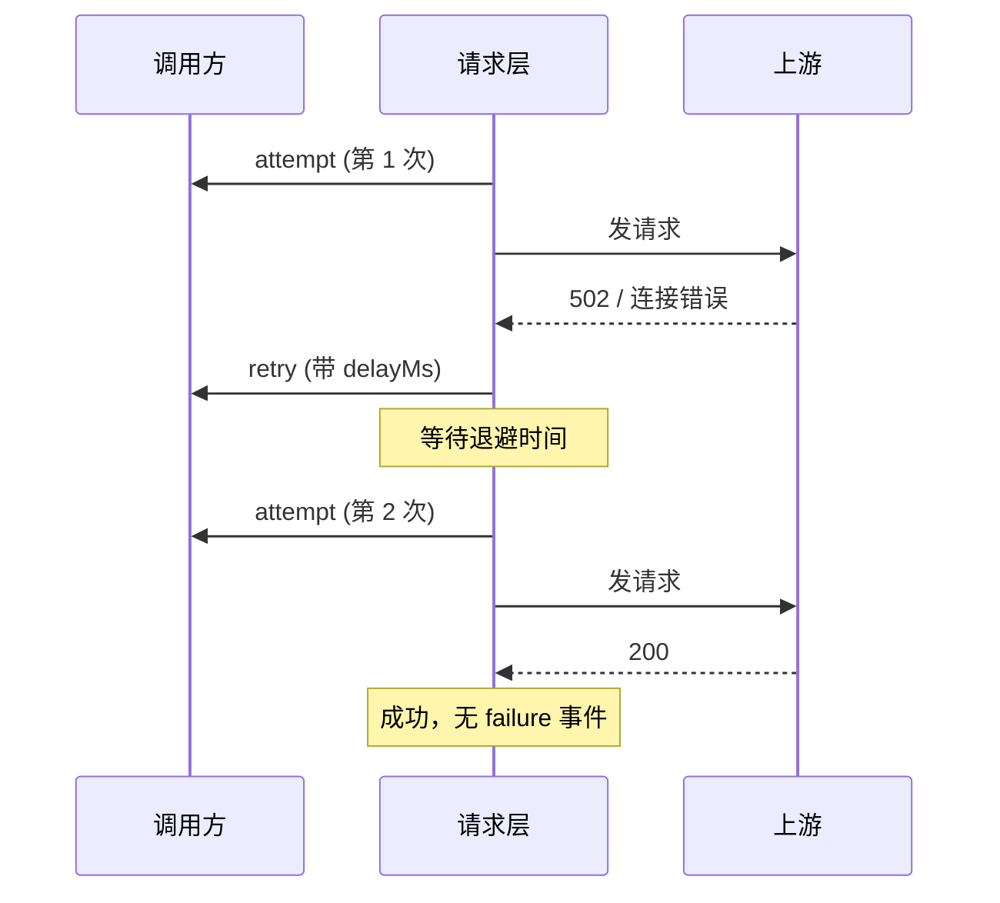

# 调试与可观测性

请求层内部跑着重试、退避、连接切换这些逻辑。默认情况下这些过程不可见，可以通过 `onRequestEvent` hook 拿到每一次尝试、重试和失败。

## `onRequestEvent`

在 `config` 里传一个回调，请求层会在每次尝试、重试、失败时调用它：

```ts
import { createHanaMusicApi, type RequestDebugEvent } from 'hana-music-api'

const hana = createHanaMusicApi({
  onRequestEvent(event: RequestDebugEvent) {
    console.log(event.type, event.url, event.status ?? event.error ?? '')
  },
})
```

它是纯观测回调，只读，不会影响请求结果。

## 事件结构

```ts
interface RequestDebugEvent {
  type: 'attempt' | 'retry' | 'failure'
  attempt: number // 当前是第几次尝试
  maxAttempts: number // 最多尝试几次
  connectionStrategy: 'default' | 'close' | 'fresh-on-retry'
  crypto: '' | 'api' | 'eapi' | 'weapi' | 'linuxapi'
  url: string
  status?: number // 拿到响应时的状态码
  error?: string // 传输错误时的错误信息
  durationMs?: number // 本次尝试耗时
  delayMs?: number // 重试前的等待时长
}
```

## 三种事件



- **`attempt`**：每次发起请求前触发。带 `attempt` / `maxAttempts` / `connectionStrategy` / `crypto` / `url`。
- **`retry`**：决定要重试时触发。额外带 `delayMs`（即将等待多久），以及触发原因，即 `status`（业务状态码）或 `error`（传输错误）。
- **`failure`**：重试用尽、最终失败时触发。带 `durationMs` 和失败原因。

成功的请求只会有 `attempt` 事件，不会有 `failure`。

## 实用示例：接入耗时统计

```ts
import { createHanaMusicApi, type RequestDebugEvent } from 'hana-music-api'

function onRequestEvent(event: RequestDebugEvent) {
  switch (event.type) {
    case 'attempt':
      // 记录开始，或上报 QPS
      break
    case 'retry':
      console.warn(
        `[retry] ${event.url} 第 ${event.attempt}/${event.maxAttempts} 次后重试，` +
          `原因=${event.status ?? event.error}，等待 ${event.delayMs}ms`,
      )
      break
    case 'failure':
      console.error(
        `[failure] ${event.url} 最终失败，耗时 ${event.durationMs}ms，` +
          `原因=${event.status ?? event.error}`,
      )
      break
  }
}

const hana = createHanaMusicApi({ onRequestEvent })
```

## 它和自定义 fetcher 的区别

两者都能观测请求，但层次不同：

| | `onRequestEvent` | 自定义 `fetcher` |
| --- | --- | --- |
| 层次 | 请求层的语义事件 | 原始网络层 |
| 能看到 | 尝试序号、重试原因、退避时长、加密模式 | 原始的 URL、请求头、响应体 |
| 能改请求吗 | 不能（只读观测） | 能（完全接管） |

需要语义化的重试/失败洞察，用 `onRequestEvent`；需要改写请求或接管连接，用 [自定义 fetcher](/guide/custom-fetcher)。两者可以同时用。
