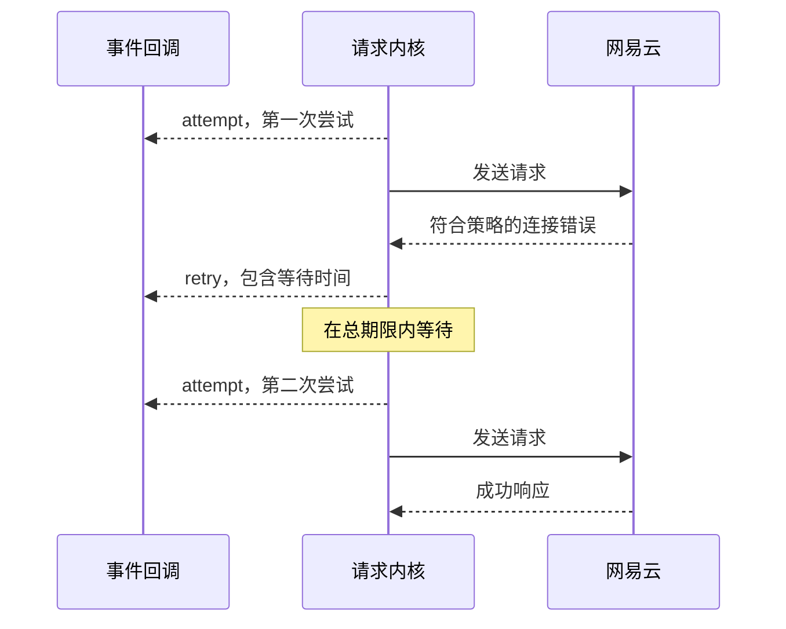

# 调试与可观测性

需要知道请求有没有重试、为什么失败时，可以传入 `onRequestEvent`。需要统计完整调用耗时，则在调用外层计时。

## 记录请求事件

```ts
import { createHanaMusicApi } from 'hana-music-api';

const hana = createHanaMusicApi({
  onRequestEvent(event) {
    console.log({
      type: event.type,
      attempt: event.attempt,
      status: event.status,
      durationMs: event.durationMs,
      delayMs: event.delayMs,
      url: event.url,
    });
  },
});

await hana.search({ keywords: '海阔天空' });
```

回调只用于观测，应保持轻量并避免抛错。事件 URL 已移除 query，事件不提供 Cookie 字段；自定义日志也不要记录凭据或完整请求正文。

| 事件      | 表示什么                                      |
| --------- | --------------------------------------------- |
| `attempt` | 请求内核开始一次尝试                          |
| `retry`   | 这次失败符合重试规则，接下来按 `delayMs` 等待 |
| `failure` | 请求尝试遇到无法继续重试的失败                |

`attempt` 不等于请求已经真正发出，不能直接拿它当上游实际请求数。一次最终成功的调用也可能先出现多个 `attempt` 和 `retry`。


```mermaid
sequenceDiagram
  participant App as 事件回调
  participant Core as 请求内核
  participant Upstream as 网易云
  Core-->>App: attempt，第一次尝试
  Core->>Upstream: 发送请求
  Upstream-->>Core: 符合策略的连接错误
  Core-->>App: retry，包含等待时间
  Note over Core: 在总期限内等待
  Core-->>App: attempt，第二次尝试
  Core->>Upstream: 发送请求
  Upstream-->>Core: 成功响应
```

## 每个字段怎样理解

| 字段                     | 含义                                                 |
| ------------------------ | ---------------------------------------------------- |
| `attempt`、`maxAttempts` | 当前尝试序号和请求层记录的尝试上限；不表示必定会重试 |
| `connectionStrategy`     | 这次尝试使用的连接策略                               |
| `crypto`                 | API 加密模式，普通文本或字节请求使用空字符串         |
| `url`                    | 移除 query 后的请求地址                              |
| `status`、`error`        | 可用时提供失败状态或错误信息                         |
| `durationMs`             | 通常为这次失败尝试的耗时，不是稳定的整次调用耗时     |
| `delayMs`                | 下一次尝试前的等待时间                               |

这些字段的公开类型是 `RequestDebugEvent`。参数检查失败、缓存命中、模块本地计算或外层取消等情况，不一定产生对应请求事件。共享读取只执行一次上游工作，也不会替每个等待者各发一套事件。

因此不要依赖 `failure` 统计所有调用失败，也不要把没有 `failure` 当成调用成功的证明。直接 `createRequest` 的边界还会补充部分取消或超时失败事件，其耗时范围与普通请求尝试可能不同。

## 统计完整调用耗时

```ts
import { search } from 'hana-music-api';

const startedAt = performance.now();
try {
  const result = await search({ keywords: '海阔天空' });
  console.log(result.status, result.body);
} catch (error: unknown) {
  console.error(error);
} finally {
  console.log({ elapsedMs: performance.now() - startedAt });
}
```

这样能把身份初始化、缓存等待、重试和正文读取算在同一次调用里。错误对象的处理见 [返回值与错误](/guide/programmatic-api#返回值与错误)。

## 什么时候需要自定义 fetcher

`onRequestEvent` 观察请求内核的尝试与重试。自定义 `fetcher` 则能看到真正交给传输实现的 URL、请求头和响应，可以用于连接管理或测试。

包装 `fetch` 后立刻返回 `Response`，测到的通常只是收到响应头之前的时间；后续读取正文仍由内核完成。自定义实现与取消要求见 [自定义 fetcher](/guide/custom-fetcher)。

维护者可以继续阅读 [架构详解](/guide/request-layer-overview)，以及仓库中的 `tests/load/` 和 `agent-docs/TESTING.md`。
