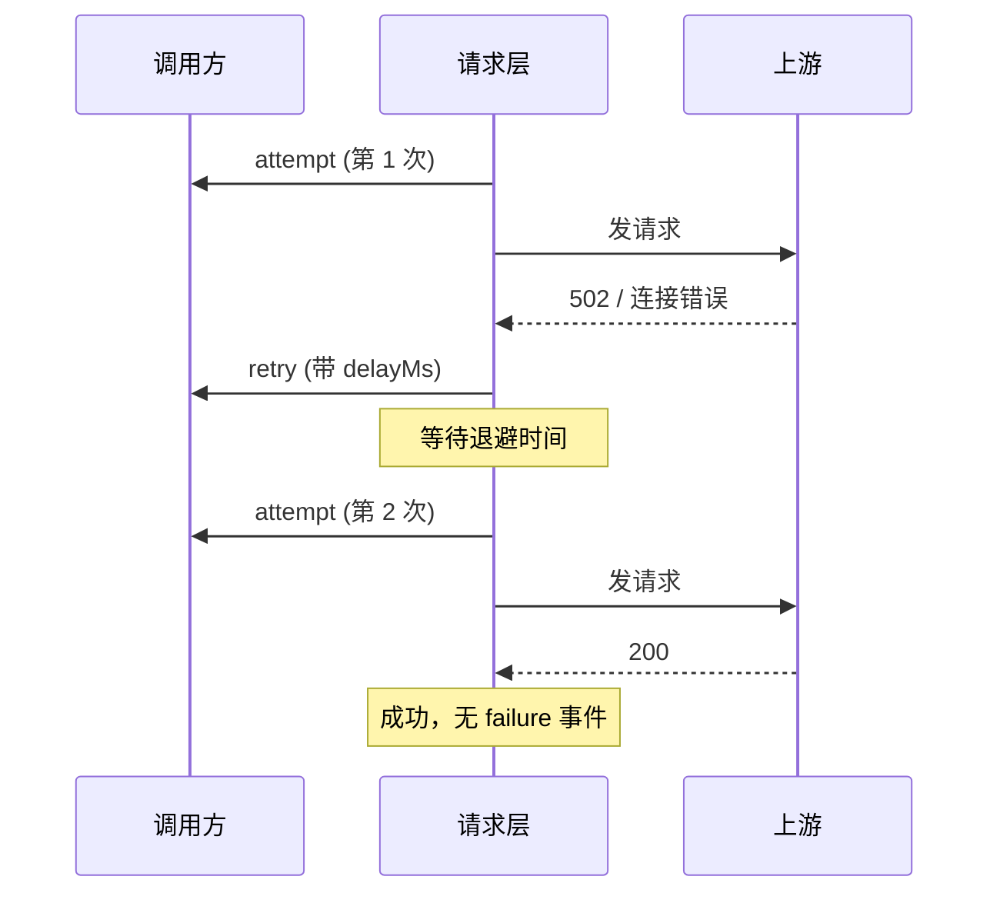

# 调试与可观测性

请求层内部跑着重试、退避、连接切换这些逻辑。默认情况下这些过程不可见，可以通过 `onRequestEvent` hook 拿到每一次尝试、重试和失败。

## `onRequestEvent`

在 `config` 里传一个回调，请求层会在每次尝试、重试、失败时调用它：

```ts
import { createHanaMusicApi, type RequestDebugEvent } from 'hana-music-api';

const hana = createHanaMusicApi({
  onRequestEvent(event: RequestDebugEvent) {
    console.log(event.type, event.url, event.status ?? event.error ?? '');
  },
});
```

回调应只做观测，避免抛出异常。事件 URL 去掉 query，不包含 Cookie 或 token；自定义日志也应遵循这一约束。

## 事件结构

```ts
interface RequestDebugEvent {
  type: 'attempt' | 'retry' | 'failure';
  attempt: number; // 当前是第几次尝试
  maxAttempts: number; // 最多尝试几次
  connectionStrategy: 'default' | 'close' | 'fresh-on-retry';
  crypto: '' | 'api' | 'eapi' | 'weapi' | 'linuxapi';
  url: string;
  status?: number; // 拿到响应时的状态码
  error?: string; // 传输错误时的错误信息
  durationMs?: number; // 本次尝试耗时
  delayMs?: number; // 重试前的等待时长
}
```

## 三种事件


```mermaid
sequenceDiagram
  participant C as 调用方
  participant R as 请求层
  participant U as 上游
  R->>C: attempt (第 1 次)
  R->>U: 发请求
  U-->>R: 502 / 连接错误
  R->>C: retry (带 delayMs)
  Note over R: 等待退避时间
  R->>C: attempt (第 2 次)
  R->>U: 发请求
  U-->>R: 200
  Note over R: 成功，无 failure 事件
```

- **`attempt`**：每次发起请求前触发。带 `attempt` / `maxAttempts` / `connectionStrategy` / `crypto` / `url`。
- **`retry`**：决定要重试时触发。额外带 `delayMs`（即将等待多久），以及触发原因，即 `status`（业务状态码）或 `error`（传输错误）。
- **`failure`**：重试用尽、最终失败时触发。带 `durationMs` 和失败原因。

成功的请求只会有 `attempt` 事件，不会有 `failure`。

## 实用示例：接入耗时统计

```ts
import { createHanaMusicApi, type RequestDebugEvent } from 'hana-music-api';

function onRequestEvent(event: RequestDebugEvent) {
  switch (event.type) {
    case 'attempt':
      // 记录开始，或上报 QPS
      break;
    case 'retry':
      console.warn(
        `[retry] ${event.url} 第 ${event.attempt}/${event.maxAttempts} 次后重试，` +
          `原因=${event.status ?? event.error}，等待 ${event.delayMs}ms`,
      );
      break;
    case 'failure':
      console.error(
        `[failure] ${event.url} 最终失败，耗时 ${event.durationMs}ms，` +
          `原因=${event.status ?? event.error}`,
      );
      break;
  }
}

const hana = createHanaMusicApi({ onRequestEvent });
```

## 它和自定义 fetcher 的区别

两者都能观测请求，但层次不同：

|            | `onRequestEvent`                       | 自定义 `fetcher`           |
| ---------- | -------------------------------------- | -------------------------- |
| 层次       | 请求层的语义事件                       | 原始网络层                 |
| 能看到     | 尝试序号、重试原因、退避时长、加密模式 | 原始的 URL、请求头、响应体 |
| 能改请求吗 | 不能（只读观测）                       | 能（完全接管）             |

需要语义化的重试/失败洞察，用 `onRequestEvent`；需要改写请求或接管连接，用 [自定义 fetcher](/guide/custom-fetcher)。两者可以同时用。

## 内部流量与本地压力测试

内部 RequestRuntime 提供发送、冷却、完成事件和活动/等待计数，只记录 host 与状态，不记录原始身份。全路径 API、网页与 NOS 都经过同一出口许可。

`bun run test:load:smoke` 执行本地场景验证和 100 用户、500 请求的真实 Bun HTTP 压测。
`bun run test:load:soak` 执行 10 分钟负载，逐分钟交替稳定请求和 100 并发突发。
机器可读 JSON 保存到 `_notes/load-reports/`，包括延迟、吞吐、状态分布、出口并发、队列、RSS/堆和最终许可状态。该目录受全局 Git ignore，CI 上传报告作为 artifact。

smoke 覆盖同键合并、默认入口过载、读写混合、HTTP/业务 429 冷却、慢正文、客户端断连和完整图片上传。正常负载成功请求 p95 必须小于 1 秒，快速过载拒绝 p95 必须小于 250 毫秒；
饱和出口的请求可有界等待，测量耗时上限为 2.5 秒。缺少正常成功或压力拒绝样本、资源未释放或阈值越界都会使命令失败。预期的超时与取消单独记录为 504/499，所有请求状态必须计入验收总数。

soak 以 4 请求/秒与 100 并发突发交替运行；每次切入突发前等待 2 秒，让 host 令牌桶补满以验证 8 个出口许可。本地显式信任 loopback 代理，以模拟 100 个连接身份。
报告包含 HEAD、全部未提交内容的 SHA-256 指纹和失败原因；负载期间代码变化会使验收失败。末三分钟 RSS 相对该窗口起点的最大增长不得超过 30%。

假 transport 只将已校验的逻辑网易云 URL 映射至固定 loopback socket，不读取账号，不向真实上游压测。
