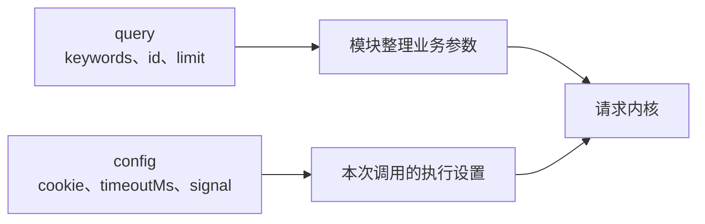

# 编程式调用

SDK 的常用入口有三个：创建 client、导入具名函数、按模块名调用。它们都返回 Promise，业务参数和执行配置分开传。

## 连续调用多个接口

`createHanaMusicApi` 将一组默认配置绑定到 client。适合共享 Cookie、缓存或自定义 `fetcher` 的场景。

```ts
import { createHanaMusicApi } from 'hana-music-api';

const hana = createHanaMusicApi({
  cookie: 'MUSIC_U=your-cookie',
  timeoutMs: 8000,
});

const searchResult = await hana.search({ keywords: '周杰伦', limit: 5 });
const songResult = await hana.songUrl({ id: '347230', br: 320000 });

console.log(searchResult.body, songResult.body);
```

方法的第二个参数覆盖这次调用的默认配置。覆盖按字段进行，比如传入新的 `headers` 对象会替换原来的 `headers`，不会递归合并对象里的每个字段。

```ts
await hana.search({ keywords: '林俊杰' }, { timeoutMs: 5000 });
```

## 只调用少量接口

可以直接导入具名函数。名称采用 camelCase，例如 HTTP 的 `/song/url` 对应 `songUrl`：

```ts
import { songUrl } from 'hana-music-api';

const result = await songUrl(
  { id: '347230' },
  { cookie: 'MUSIC_U=your-cookie' },
);

console.log(result.body);
```

这里导入的是公开的 Promise 包装函数。仓库 `src/modules/` 里的默认导出是内部 Effect 实现，不是下游应直接导入的 SDK 函数。

## 按模块名调用

模块名在运行时选择时，用 `invokeModule(identifier, query, config)`。模块标识采用下划线形式，TypeScript 中用 `ModuleIdentifier` 表示受支持的名称集合。

```ts
import { invokeModule } from 'hana-music-api';

const result = await invokeModule(
  'user_account',
  {},
  { cookie: 'MUSIC_U=your-cookie' },
);

console.log(result.body);
```

## 业务参数和执行配置



`query` 的类型来自模块自己的输入声明。`config` 使用 `ModuleCallConfig`，完整字段见 [配置参考](/guide/config-reference)。HTTP 能接收的字段更少，见 [调用约定](/guide/request-convention)。

## 返回值与错误

SDK 返回 `{ status, body, cookie }`：

| 字段     | 含义                                                       |
| -------- | ---------------------------------------------------------- |
| `status` | 请求层或模块整理后的状态码，不一定等于上游原始 HTTP 状态码 |
| `body`   | 接口正文，可能包含业务 `code`，普通响应保留未知 JSON       |
| `cookie` | 上游下发的 Cookie 字符串数组                               |

执行失败时，Promise 通常会以同样的三字段对象拒绝，所以不能只读取 `error.message`。模块也可能正常返回带失败状态的结果；例如既没传文件也没传图片编号的歌单封面更新会返回 `status: 400`。成功完成 `await` 后仍要检查状态，业务状态则按具体接口处理。

```ts
import { search } from 'hana-music-api';

try {
  const result = await search({ keywords: '海阔天空' });
  if (result.status !== 200) {
    console.error(result.status, result.body);
  } else {
    console.log(result.body);
  }
} catch (error: unknown) {
  if (
    typeof error === 'object' &&
    error !== null &&
    'status' in error &&
    'body' in error
  ) {
    console.error(error.status, error.body);
  } else {
    throw error;
  }
}
```

部分业务码会映射为成功状态，二维码轮询的 `800` 至 `803` 就需要继续检查 `body.code`。不要把 `status === 200` 等同于所有业务操作成功。

普通 `body` 没有为每个端点假定完整字段。若要读取 `body.songs` 等属性，先检查正文是对象、目标字段是预期类型。模块内部对自己需要读取的字段也采用同样的原则。登录相关的模块已经在运行时校验了返回体，`body` 有确定的类型，并导出了结构定义，见 [返回体结构](/guide/response-bodies)。

常见的执行失败包括参数错误 `400`、网易云限频 `429`、取消 `499`、传输或响应处理失败 `502`、超时 `504`。做了返回体校验的模块在网易云改了返回结构时也以 `502` 拒绝，`body.upstreamShape` 写明出错的位置。SDK 不在本地限制请求频率，调用方要自己控制，处理方式见 [重试、超时与连接策略](/guide/retry-timeout-resilience)。
