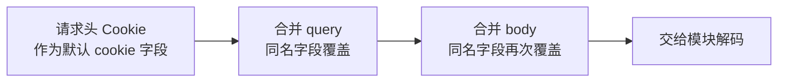

# HTTP 调用约定

HTTP 路由和 SDK 方法使用同一套业务模块，但参数传递和返回形式不同。SDK 的用法见 [编程式调用](/guide/programmatic-api)。

## 传入业务参数

普通接口可以通过 GET query 或 POST body 传参。服务能解析 JSON、URL 编码表单和 multipart 表单。上传文件时使用 POST multipart，字段名以接口页为准。

```bash
curl 'http://127.0.0.1:3021/search' \
  -H 'Content-Type: application/json' \
  --data '{"keywords":"海阔天空","limit":5}'
```

JSON body 应是对象，不能是数组或单个值。query 中的数字通常是字符串，模块会按自己的输入规则检查和整理。

HTTP 还保留 `cookie` 和 `noCookie`。`domain`、`proxy`、`headers`、`fetcher`、`state`、`retry`、`timeoutMs`、`signal`、`crypto`、`ip`、`realIP`、`ua` 等执行配置不能从 HTTP 传入，服务会在发送上游请求前返回 400。需要这些设置时，在受信任的服务端代码里调用 SDK。

## Cookie 和参数的覆盖顺序



`cookie` 是整体替换，不是把三个来源的每一对 Cookie 都合并。body 里传了 `cookie`，就使用 body 的值。

上游返回的 Cookie 会通过 `Set-Cookie` 写回。HTTPS 响应会补上 `SameSite=None; Secure`。`noCookie=true`、`noCookie=1` 可以停止写回，但不会清空请求身份，也不会阻止模块处理 Cookie。

## HTTP 返回什么

SDK 返回 `{ status, body, cookie }`，HTTP 服务则将其中的 `body` 作为 JSON 正文，`status` 作为 HTTP 状态码，Cookie 放在响应头里。

某些业务状态会保留在 JSON 的 `code` 中，比如二维码状态 `800` 至 `803`。因此应用要同时检查 HTTP 状态和接口自己的业务字段。

| 状态  | 常见含义                                     |
| ----- | -------------------------------------------- |
| `400` | 输入不符合要求，或通过 HTTP 传入执行配置     |
| `408` | 客户端请求体读取超时                         |
| `413` | 客户端请求体过大                             |
| `429` | 入口请求太频繁，或上游处于限流冷却中         |
| `499` | 调用已取消；客户端已经断开时未必还能收到响应 |
| `502` | 上游传输或响应处理失败                       |
| `503` | 模块容量或出口额度不足                       |
| `504` | 模块调用超过期限                             |

429 和容量拒绝会附带 `Retry-After`。参数限制、可信代理和限流配置见 [部署 HTTP 服务](/guide/server-deployment)。

## 哪些响应会缓存

HTTP 默认将 `search`、`lyric`、`song_detail`、`playlist_detail` 的成功结果缓存 120 秒。同一服务实例中的相同读取也会合并，身份、参数和执行设置都参与判断。

登录、二维码轮询、批量、写入、上传和未列入清单的模块不走这份缓存。轮询无需用时间戳绕过本地缓存。

不要把变化的 `timestamp` 当成本库通用的刷新开关。搜索等模块会在构造缓存键前移除未声明字段，增加时间戳仍可能命中同一个结果。需要关闭 HTTP 本地缓存时，使用源码服务配置 `cacheEnabled: false`；CDN 等外部缓存应分别配置。
