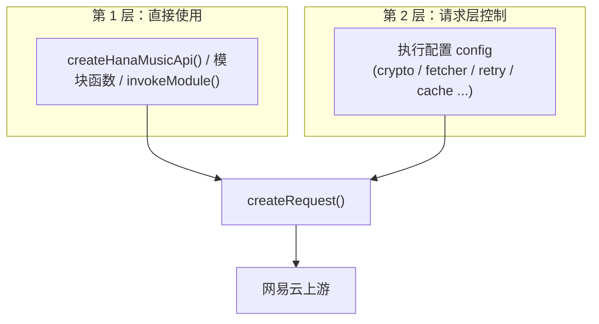
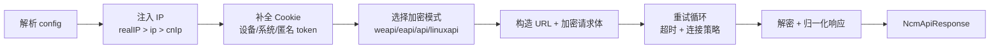

# 请求层架构总览

如果需要将 `hana-music-api` 进行高度的请求层自定义，如换掉底层的 fetch、加上重试和超时、做流量伪装、接入埋点、或者绕过模块层直接请求上游，就需要理解请求层做了什么。

## 两层使用模型

可以把这个项目的使用方式分成两层：

- **第 1 层**：给业务参数 `query`，拿到响应。请求怎么发、用什么加密、要不要重试，都由默认值兜底。
- **第 2 层**：通过 `config` 介入请求的每一个环节。模块层把这些配置原样透传给 `createRequest()`，所以第 1 层能用的接口，第 2 层的能力它全都能用。

关键点：**两层共用同一条请求链路**。不需要为了用上重试或自定义 fetch 就换一套 API，只要往 `config` 里多传几个字段即可。

## 一次请求经历了什么

无论走哪个入口，最终都会落到 `createRequest()`。它内部是一条固定的管线：

每一步都对应一组可配置项，后面的文档会逐个拆开讲：

1. **IP 注入**：`ip` / `realIP`，以及运行时默认的伪装中国 IP。见 [运行时状态与身份伪装](/guide/runtime-identity)。
2. **Cookie 补全**：请求层会自动补上设备号、系统伪装串、匿名 token 等字段，只需要管 `MUSIC_U`。见 [运行时状态与身份伪装](/guide/runtime-identity)。
3. **加密模式**：决定走哪条上游通道、用哪套加解密。见 [加密模式](/guide/crypto-modes)。
4. **重试 / 超时 / 连接策略**：决定请求失败后怎么处理。见 [重试、超时与连接策略](/guide/retry-timeout-resilience)。
5. **响应解密与归一化**：把上游的加密二进制还原成 JSON，并统一状态码。见 [加密模式](/guide/crypto-modes)。

整条链路上还挂着一个观测点 `onRequestEvent`，每次尝试、重试、失败都会回调，方便接日志和埋点。见 [调试与可观测性](/guide/observability)。

## 各文件的职责

请求层的代码集中在 `src/core/`：

| 文件 | 职责 |
| --- | --- |
| `core/request.ts` | 请求主链路：Cookie 补全、加密分支、重试循环、响应解密。**所有兼容逻辑都集中在这里**，模块只管组装参数。 |
| `core/options.ts` | 把模块层的 `query` 收敛成 `createRequest` 能消费的配置结构。 |
| `core/crypto.ts` | weapi / eapi / linuxapi 的加解密实现（内部）。 |
| `core/runtime.ts` | 进程级运行时状态：匿名 token、伪装 IP、设备号。 |
| `core/anonymous.ts` | 匿名身份注册与懒加载（内部）。 |
| `core/identity.ts` | 可选的匿名身份池与轮换（内部）。 |
| `core/cache.ts` | SDK 侧的内存响应缓存。 |
| `core/config.ts` | 域名、系统伪装档、User-Agent 等常量。 |

## 哪些是公开 API，哪些是内部实现

区分清楚，避免依赖到不该依赖的实现。

**可以直接 import、属于公开合同的**：

- 入口函数：`createHanaMusicApi`、`invokeModule`、各模块函数、`createRequest`、`createOption`
- 类型：`ModuleCallConfig`、`CreateHanaMusicApiConfig`、`RequestCrypto`、`RequestRetryOptions`、`RequestConnectionStrategy`、`RequestDebugEvent`、`RuntimeState`、`CookieRecord`、`FetchLike`、`NcmApiResponse`

**属于内部实现、不对外承诺稳定的**：

- `crypto.ts` 里的 `weapi` / `eapi` / `eapiResDecrypt` 等加解密函数
- `getRuntimeState` / `setRuntimeState` / `ensureRuntimeAnonymousToken` / `registerAnonymousToken`
- Bun server、CLI 相关入口

后面文档讲到内部机制时只说明**原理**，不会要求你 import 这些符号。需要介入的地方，都可以通过 `config` 里的公开字段完成。

## 接下来读什么

- 想先看全部能改什么：[执行配置完整参考](/guide/config-reference)
- 想换掉底层网络实现：[自定义 fetcher](/guide/custom-fetcher)
- 想做高频调用 / 反风控：[SDK 缓存与身份池](/guide/sdk-cache-and-identity-pool)
- 想绕过模块层直接打上游：[直接使用请求原语](/guide/create-request-and-create-option)
