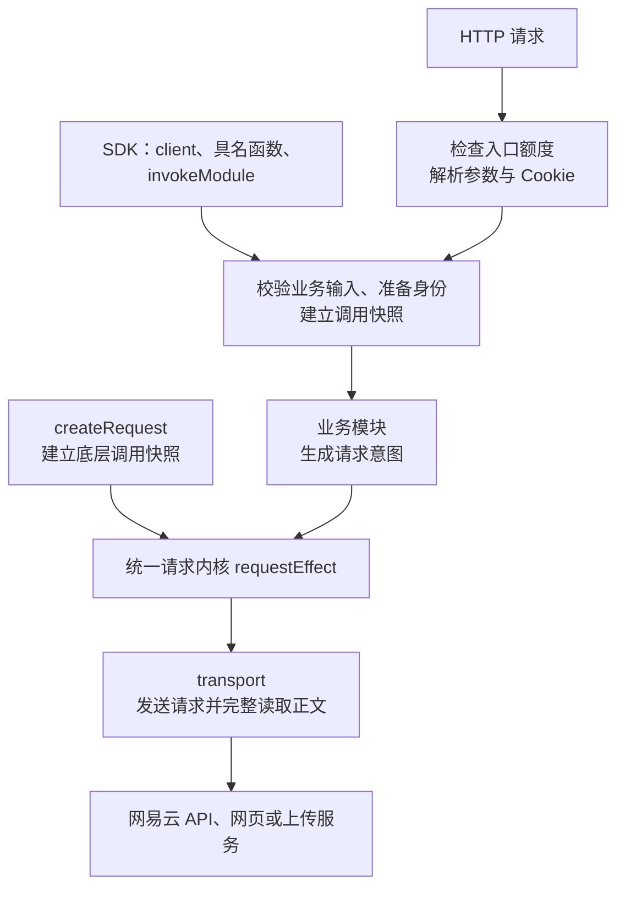
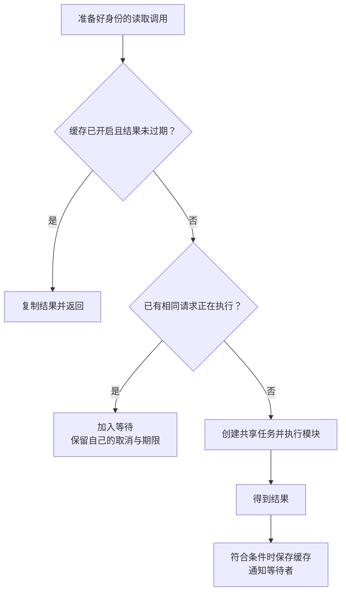
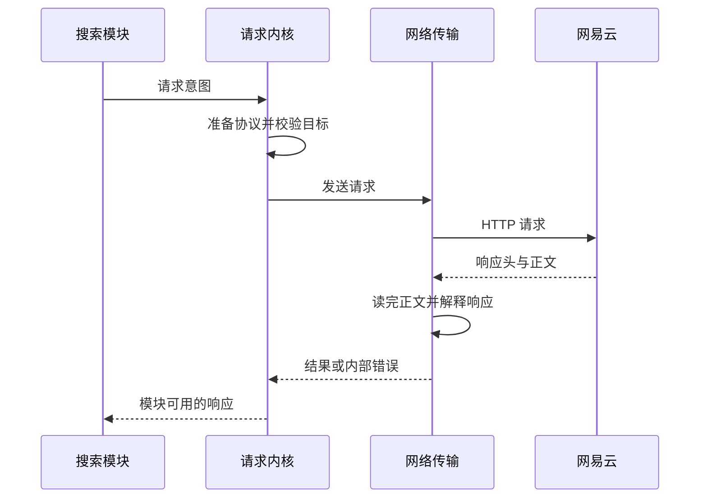
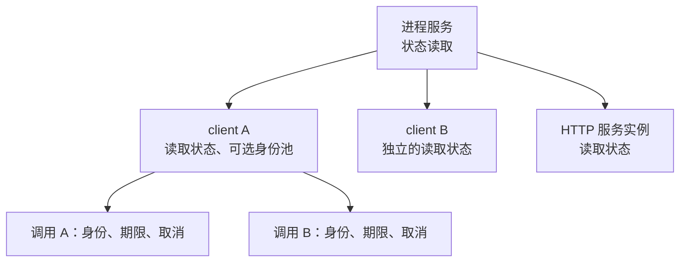

# hana-music-api 架构详解

假设你要搜索一首歌，调用的是 `hana.search({ keywords: '海阔天空' })`。从这行代码到网易云返回结果，中间会检查参数、准备身份、处理缓存、加密请求，还要照顾超时和取消。

这些工作由同一条内部执行流程完成。SDK 对外仍返回 Promise，你可以照常用 `async/await`。维护仓库里的模块时，才需要接触 Effect。

## 从三个入口进入

SDK client、具名函数和 `invokeModule` 都会执行对应的业务模块。HTTP 服务先解析请求，再执行同一套模块。`createRequest` 则让你直接提供上游路径和数据，跳过模块的业务参数转换。

```mermaid
flowchart TD
  SDK["SDK：client、具名函数、invokeModule"] --> CALL["校验业务输入、准备身份<br/>建立调用快照"]
  HTTP["HTTP 请求"] --> EDGE["检查入口额度<br/>解析参数与 Cookie"]
  EDGE --> CALL
  CALL --> MODULE["业务模块<br/>生成请求意图"]
  DIRECT["createRequest<br/>建立底层调用快照"] --> CORE["统一请求内核 requestEffect"]
  MODULE --> CORE
  CORE --> TRANSPORT["transport<br/>发送请求并完整读取正文"]
  TRANSPORT --> UPSTREAM["网易云 API、网页或上传服务"]
```

图里先省略了缓存和返回路径。Hono 只负责 HTTP 边界，内部请求内核不依赖 Hono。`createRequest` 也会进入同一个内核，但不会自动获得模块级读缓存或 SDK 的游客身份初始化。

## 跟着一次搜索走完流程

### 先检查参数，再准备身份

`search` 在自己的模块文件里声明输入类型和解码器。解码器负责检查并整理外部数据，比如确认 `keywords` 是字符串，`limit` 是数字或数字字符串。

这一步发生在身份初始化和缓存检查之前。参数不对，就不会为了这次调用再注册游客身份或发送搜索请求。已声明字段的模块会移除未知字段；保留旧式对象输入的模块则允许未知业务字段，具体边界由模块自己的解码器决定。

接下来根据配置选择登录身份或游客身份。SDK 缺少身份时会尝试初始化游客身份；HTTP 服务通过 CLI 启动时，会在启动阶段准备匿名令牌。

### 为这次调用保存一份快照

内部的 `Call` 表示一次模块调用。它保存整理后的业务参数、执行配置、有效身份和截止时间。模块后续发出多次请求时，仍使用这次调用的身份，不会中途换成全局状态里刚更新的账号。

普通模块默认有 8 秒总期限。准备游客身份、重试和读取正文都算在这 8 秒里。两个相同的读取可以共享上游工作，但每个调用者仍有自己的期限，详见 [超时与取消](/guide/retry-timeout-resilience)。

### 检查能否复用读取结果

目前只有 `search`、`lyric`、`song_detail`、`playlist_detail` 进入共享读取流程。其他模块继续独立执行。

```mermaid
flowchart TD
  CALL["准备好身份的读取调用"] --> CACHE{"缓存已开启且结果未过期？"}
  CACHE -->|是| COPY["复制结果并返回"]
  CACHE -->|否| SHARED{"已有相同请求正在执行？"}
  SHARED -->|是| WAIT["加入等待<br/>保留自己的取消与期限"]
  SHARED -->|否| EXECUTE["创建共享任务并执行模块"]
  EXECUTE --> RESULT["得到结果"]
  RESULT --> SAVE["符合条件时保存缓存<br/>通知等待者"]
```

判断请求是否相同，除了业务参数，还会考虑账号身份、目标配置和传输实现。不同账号的结果不会因为搜索词一样就混用。

负责这部分工作的 `ReadStore` 同时保存缓存和正在执行的任务。缓存关闭时，正在执行的相同读取仍可合并。具体用法见 [缓存与身份池](/guide/sdk-cache-and-identity-pool)。

### 模块描述请求，内核负责执行

搜索模块把 `keywords` 转成上游要求的 `s`，再提供目标路径、协议、方法和正文。这份描述叫 `RequestIntent`，也就是请求意图。

模块通过传入的 `RequestCapability` 提交它。这个名字表示模块拥有的请求能力，其默认实现就是 `requestEffect`。模块不直接调用 `fetch`，也不在内部启动另一套 Promise 执行器。

内核根据调用快照准备 URL、Cookie、请求头和加密正文，校验最终目标，再按策略执行请求。内核不在本地限制发送频率，每次尝试都直接发出；请求频率由调用方控制，见 [请求频率由调用方控制](/guide/retry-timeout-resilience#请求频率由调用方控制)。只有允许重试的操作和失败类型才会进入下一次尝试。

```mermaid
sequenceDiagram
  participant Module as 搜索模块
  participant Core as 请求内核
  participant Transport as 网络传输
  participant Upstream as 网易云
  Module->>Core: 请求意图
  Core->>Core: 准备协议并校验目标
  Core->>Transport: 发送请求
  Transport->>Upstream: HTTP 请求
  Upstream-->>Transport: 响应头与正文
  Transport->>Transport: 读完正文并解释响应
  Transport-->>Core: 结果或内部错误
  Core-->>Module: 模块可用的响应
```

响应头到了，不代表请求结束。正文读取、解密和解释也属于这次执行。遇到超时或取消，内核会中断工作并释放自己的资源；自定义 `fetcher` 仍需配合传入的取消信号。

## 哪些状态共享，哪些只属于一次调用

| 范围                    | 保存什么                                    | 对调用者的影响                                         |
| ----------------------- | ------------------------------------------- | ------------------------------------------------------ |
| 进程                    | 匿名运行时状态                              | 多个 client 共用同一份匿名身份                         |
| client 或 HTTP 服务实例 | 各自的 `ReadStore`；client 可选的匿名身份池 | 不同 client 的缓存独立；同一 client 的方法共用读取状态 |
| 单次调用                | 参数、配置、身份快照、截止时间              | 单次覆盖只影响这次调用，取消也先作用于这个调用者       |

具名函数保留各自的调用上下文，公开 `invokeModule` 复用其调用上下文；它们默认不保存已完成结果的缓存。共享范围不能仅凭“在同一进程”判断。

```mermaid
flowchart TD
  PROCESS["进程服务<br/>状态读取"] --> ClientOne["client A<br/>读取状态、可选身份池"]
  PROCESS --> ClientTwo["client B<br/>独立的读取状态"]
  PROCESS --> SERVER["HTTP 服务实例<br/>读取状态"]
  ClientOne --> CallOne["调用 A：身份、期限、取消"]
  ClientOne --> CallTwo["调用 B：身份、期限、取消"]
```

## Effect 在这里解决什么问题

一次请求可能还在准备身份，也可能已经拿到响应头、正在读正文。Effect 让这些步骤使用同一套取消、超时和资源清理规则，减少每个入口自己维护计时器和清理逻辑的情况。

| 名字                                       | 在项目里的用途                             |
| ------------------------------------------ | ------------------------------------------ |
| `Context.Service`、`Effect.provideService` | 声明工作需要的服务，并在执行时提供具体服务 |
| `Ref`                                      | 集中更新共享状态，例如缓存记录和等待人数   |
| `Deferred`                                 | 让多个等待者接收同一个任务结果             |
| `Fiber`                                    | 管理正在执行的共享工作，必要时中断它       |
| `Scope`、`acquireRelease`                  | 将取得资源和退出时的释放动作放在一起       |

当前 SDK 和 HTTP 主路径先构造服务值，再用 `Effect.provideService` 提供给工作，不经过 Layer。

比如两个调用者等同一份歌词，一个取消时只减少一个等待者。还有人在等，共享工作就继续；最后一个等待者也离开时，才中断上游。图解见 [共享读取的取消](/guide/sdk-cache-and-identity-pool#共享读取的取消)。

## 网页与上传也使用同一个请求能力

`related_playlist` 读取网页文本，再提取歌单信息。图片和声音上传则先申请上传凭据，再向网易云对象存储 NOS 发送文件，最后提交业务信息。它们用不同的协议和正文类型，但都经过相同的目标检查和取消流程。

```mermaid
flowchart LR
  TOKEN["申请上传凭据"] --> FILE["上传文件<br/>可能分多块发送"]
  FILE --> SUBMIT["提交业务信息"]
  FILE -.-> FAILURE["后续失败<br/>报告已经完成的阶段数"]
  SUBMIT -.-> FAILURE
```

上传默认单阶段最多 60 秒，整个模块最多 5 分钟。已经完成的上游操作无法由本地取消回滚。如果完成部分阶段后失败，公开错误体会带 `partialCompletion: true` 和数字 `completedStages`。它表示完成的请求阶段数，不是上传百分比，也不是公开的阶段名称列表。

## 最后怎样返回给使用者

普通上游响应保留为未知 JSON。模块只有需要读取字段时才检查那部分结构，比如歌单模块需要读取 `trackIds`。未知字段不会因为文档没有列出就被删掉，也不会被类型声明假定为一定存在。

内部会区分输入错误、目标拒绝、超时、上游限流和上传部分完成等原因。到 Promise 边界时，`runPublicEffect` 将执行失败映射成 `{ status, body, cookie }` 对象并拒绝 Promise。模块也可能正常返回带业务失败状态的结果，因此调用方仍应检查返回状态。

HTTP 服务会把 `body` 写成 JSON，把 `status` 用作 HTTP 状态码，并按规则写回 Cookie。HTTP JSON 不是 SDK 的完整三字段外壳。错误处理示例见 [编程式调用](/guide/programmatic-api#返回值与错误)。

## 顺着源码继续看

| 想了解什么               | 仓库中的位置                                              |
| ------------------------ | --------------------------------------------------------- |
| SDK 入口与配置传递       | `index.ts`、`src/sdk/runtime.ts`                          |
| 一次调用怎样建立         | `src/core/call.ts`、`src/core/call-context.ts`            |
| 搜索参数怎样转换         | `src/modules/search.ts`                                   |
| 缓存和共享任务           | `src/core/read-store.ts`                                  |
| 请求执行与期限           | `src/core/request.ts`                                     |
| 协议准备、目标与重试策略 | `src/core/request-plan.ts`、`src/core/endpoint-policy.ts` |
| 网络发送与响应解释       | `src/core/transport.ts`、`src/core/response.ts`           |
| HTTP 入口额度            | `src/server/admission.ts`                                 |

每个模块本地声明 `ModuleInput`、导出 `decodeModuleInput`，并用 `ModuleEffect` 实现默认导出。生成器据此维护 SDK 方法、registry 和公开输入类型。维护模块时应运行 `bun run types:modules:generate`，然后按仓库的 `agent-docs/TESTING.md` 选择检查。

取消、缓存、流量控制和上传行为可以用本地假上游验证。这样的检查证明本地执行规则，不能代替真实网易云接口的可用性验证。负载场景与验收规则见仓库中的 `tests/load/`、`scripts/load-test.mts` 和 `agent-docs/TESTING.md`。
