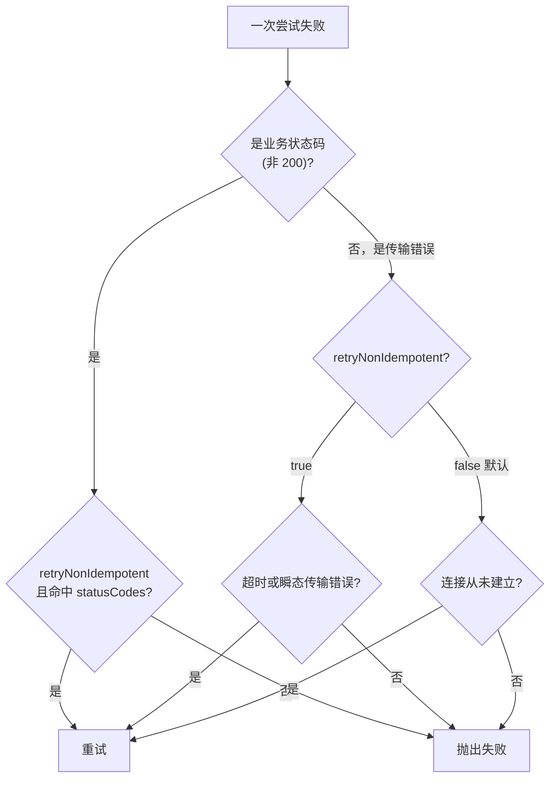

# 重试、超时与连接策略

网易云上游偶尔会超时、限流、或者断开长连接。请求层内置了一套韧性机制来应对这些情况。默认值已经能覆盖大多数场景，理解它的工作方式能在高频调用时做出更合适的取舍。

## 超时：`timeoutMs`

每一次请求尝试都有超时保护，默认 **8000 毫秒**。

```ts
await songUrl({ id: '347230' }, { timeoutMs: 5000 })
```

- 这是**单次尝试**的超时，不是整个重试过程的总超时。
- 传 `0` 或负数关闭超时。
- 超时触发后，本次尝试以 `504` 失败，错误体里会带上 `Request timed out after {timeoutMs}ms`。

> 默认开超时是为了避免高并发下挂死的连接拖垮整体吞吐。只有当明确知道某个接口就是慢、且不希望被打断时，才建议关掉。

## 重试：`retry`

重试策略通过 `retry` 对象配置：

```ts
interface RequestRetryOptions {
  retries?: number // 重试次数（仅在 retryNonIdempotent 为 true 时生效）
  backoffMs?: number // 初始退避，默认 300
  maxBackoffMs?: number // 退避上限，默认 2000
  jitter?: boolean // 退避抖动，默认 true
  retryNonIdempotent?: boolean // 是否允许重试有重复提交风险的请求，默认 false
  statusCodes?: readonly number[] // 哪些业务状态码触发重试
}
```

### 默认行为（不传 `retry`）

不传 `retry` 时的默认值如下：

- 最多尝试 **3 次**。
- 只有「连接从未建立」类的传输错误会自动重试，比如 DNS 失败、连接被拒、连接超时。这类错误能确定请求根本没到上游，重试没有重复提交风险。
- **超时、连接中途断开等歧义错误不会自动重试**，因为无法确定上游是否已经处理了请求。
- 业务状态码（如 502、301）也不会自动重试。

### 放开重试：`retryNonIdempotent`

如果能接受重复提交的风险（绝大多数读接口都可以），把 `retryNonIdempotent` 打开，重试能力会显著增强：

```ts
await songUrl(
  { id: '347230' },
  {
    retry: {
      retryNonIdempotent: true,
      retries: 3,
      statusCodes: [502, 503, 504],
    },
  },
)
```

打开后：

- `retries` 才开始生效，最大尝试次数变成 `retries + 1`（`retries` 上限为 5）。
- 超时和所有瞬态传输错误都会重试。
- `statusCodes` 里列出的业务状态码也会触发重试。

::: warning 两个开关要一起用
业务状态码重试**同时**依赖 `retryNonIdempotent: true` 和 `statusCodes`。只传 `statusCodes` 而不开 `retryNonIdempotent`，状态码重试不会生效。
:::

### 决策流程



### 退避与抖动

每次重试之间会等待一段时间，按指数退避：

```text
delay = min(backoffMs × 2^(尝试序号-1), maxBackoffMs)
```

`jitter` 默认开启，会在上面的基础上乘一个 `0.5 ~ 1.5` 的随机系数，避免大量请求在同一时刻一起重试（惊群）。

## 连接策略：`connectionStrategy`

有时问题不在请求本身，而在连接复用：上游把空闲的 keep-alive 连接关掉了，下一个复用它的请求就会报「socket 已关闭」。`connectionStrategy` 用来应对这类情况：

| 取值 | 行为 | 适用场景 |
| --- | --- | --- |
| `'default'` | 正常复用连接 | 大多数场景。 |
| `'close'` | 每次请求都新建连接（`Connection: close`） | 上游连接极不稳定，宁可牺牲复用换稳定。 |
| `'fresh-on-retry'` | 首次正常，重试时强制新连接 | 兼顾性能与稳定：正常请求复用，出问题再换新连接。 |

```ts
await songUrl(
  { id: '347230' },
  {
    connectionStrategy: 'fresh-on-retry',
    retry: { retryNonIdempotent: true, retries: 2 },
  },
)
```

此外，即使用的是 `'default'`，请求层在遇到「socket 关闭」类错误或超时后，也会**自动**在下一次重试时换用新连接，不必为这种常见情况专门配置。

## 失败响应的形状

重试用尽后，请求层会抛出一个 `NcmApiResponse` 风格的错误对象：

- 超时：`status: 504`
- 其它传输错误：`status: 502`

错误体里包含 `attempt` / `attempts` / `durationMs` / `crypto` / `url` 等字段，便于排查。配合 [调试与可观测性](/guide/observability) 的 `onRequestEvent`，能看到每一次尝试的完整过程。
