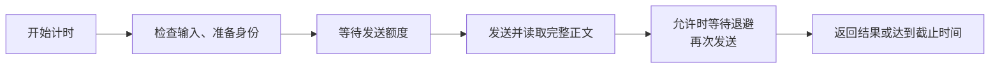
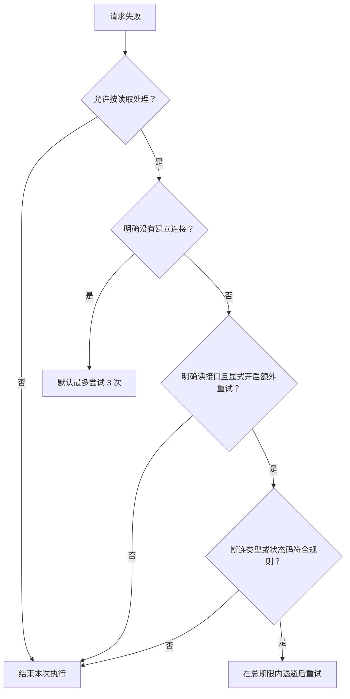

# 重试、超时与连接策略

一次调用迟迟没有结果，可能还在准备身份、等出口额度，也可能已经拿到响应头但没读完正文。`timeoutMs` 限制的是这次调用能花的总时间。

## 总期限包含哪些步骤

普通模块默认有 8 秒总期限。发生重试时，计时不会重新开始。


```mermaid
flowchart LR
  START["开始计时"] --> IDENTITY["检查输入、准备身份"]
  IDENTITY --> QUEUE["等待发送额度"]
  QUEUE --> FETCH["发送并读取完整正文"]
  FETCH --> RETRY["允许时等待退避<br/>再次发送"]
  RETRY --> END["返回结果或达到截止时间"]
```

图中的重试步骤只在策略允许时发生。即使响应头已经返回，读取正文仍受总期限约束。

| 调用                   | 默认期限                              |
| ---------------------- | ------------------------------------- |
| 普通模块，包括网页读取 | 整次调用 8 秒                         |
| 上传模块               | 整次调用最多 5 分钟，单阶段最多 60 秒 |
| `createRequest`        | 这次底层请求默认 8 秒                 |

普通调用可以用 `timeoutMs: 0` 或负数关闭总超时。上传不能借此取消保护上限；传正数时，总期限取配置值和 5 分钟的较小值，单阶段还受剩余时间限制。

HTTP 读取客户端请求体有独立的默认 5 秒限制，失败返回 408。模块执行超时返回 504，两者见 [部署 HTTP 服务](/guide/server-deployment)。

## 主动取消

```ts
import { createHanaMusicApi } from 'hana-music-api';

const hana = createHanaMusicApi({ cookie: 'MUSIC_U=your-cookie' });
const controller = new AbortController();
const pending = hana.search(
  { keywords: '海阔天空' },
  { signal: controller.signal, timeoutMs: 5000 },
);

controller.abort();
await pending.catch((error: unknown) => console.log(error));
```

取消映射为状态 499，超时为 504，其他传输失败通常为 502。HTTP 原始请求的取消信号也会传入模块执行。

共享读取中，一个调用者取消或超时只结束自己的等待。最后一个等待者离开后才中断上游。自定义 `fetcher` 必须遵守 `init.signal`，否则库只能释放自己的许可，无法强制停止第三方实现继续联网。

## 哪些失败允许重试

重试先看操作是否允许，再看失败原因。已知写入、登录、轮询、批量和上传不会被普通请求重试策略自动重放。


```mermaid
flowchart TD
  FAILURE["请求失败"] --> OPERATION{"允许按读取处理？"}
  OPERATION -->|否| STOP["结束本次执行"]
  OPERATION -->|是| CONNECT{"明确没有建立连接？"}
  CONNECT -->|是| DEFAULT["默认最多尝试 3 次"]
  CONNECT -->|否| READ{"明确读接口且显式开启额外重试？"}
  READ -->|否| STOP
  READ -->|是| REASON{"断连类型或状态码符合规则？"}
  REASON -->|否| STOP
  REASON -->|是| RETRY["在总期限内退避后重试"]
```

明确未建立连接的错误包括 `ECONNREFUSED`、`EAI_AGAIN` 和连接建立超时。其他未分类的读取也只保留这类重试。

额外重试用于搜索、歌词、歌曲详情和歌单详情对应的明确读请求。兼容字段名叫 `retryNonIdempotent`，但设为 `true` 不会解除已知写操作的保护。

```ts
import { lyric } from 'hana-music-api';

const result = await lyric(
  { id: '347230' },
  {
    retry: {
      retryNonIdempotent: true,
      retries: 2,
      backoffMs: 300,
      maxBackoffMs: 2000,
      jitter: true,
      statusCodes: [502],
    },
  },
);
console.log(result.body);
```

`retries` 表示额外尝试次数，明确读请求开启额外重试后默认为 2，最多 5。未开启这条策略时，只设置 `retries` 不会改掉默认的建连失败重试规则。

退避默认从 300 毫秒开始指数增长，以 `maxBackoffMs` 限制抖动前的延迟基数，默认开启抖动。等待也受总期限和取消约束，每次发送都重新申请出口许可。429、503、499、504 不会被这套策略重试。

## 连接策略

| 设置             | 当前行为                                                              |
| ---------------- | --------------------------------------------------------------------- |
| `default`        | 首次尝试使用默认连接行为，重试时加 `Connection: close`                |
| `close`          | 每次尝试都加 `Connection: close`                                      |
| `fresh-on-retry` | 首次使用默认行为，重试时加 `Connection: close`，当前与 `default` 相同 |

连接头并不等于完全控制底层连接池。复杂的连接管理应由自定义 `fetcher` 提供。

## 冷却与忙碌

默认 SDK 和 HTTP 路径共享进程出口额度：

| 限制                           | 默认值                    |
| ------------------------------ | ------------------------- |
| 正在向上游发送或读取正文的请求 | 最多 8 个                 |
| 每个上游域名                   | 每秒 4 次，突发 8 次      |
| 每个有效身份                   | 每秒 2 次，突发 4 次      |
| 等待出口的队列                 | 最多 32 个，最多等待 2 秒 |

额度不足会有界等待，队列满或等待过久返回 503。HTTP 入口还有另一套按连接 IP 和模块数量计算的限制，见 [部署 HTTP 服务](/guide/server-deployment)。

收到 HTTP 429 响应头时，立即开始域名和身份冷却；JSON 业务 `code: 429` 则在正文解释后开始冷却。当前请求不重试，后续请求在冷却期间返回 429。

`Retry-After` 支持秒数或 HTTP 日期，冷却限制为 1 秒至 5 分钟，缺省或无效时采用 30 秒。公开错误体用 `retryAfter` 表示秒数，HTTP 服务同时写回 `Retry-After` 响应头。

轮换身份不能绕过域名冷却。这些是本地保护参数，不是网易云官方限额，也不是不触发风控的保证。多进程需要在可信反向代理层补充共享限流。
