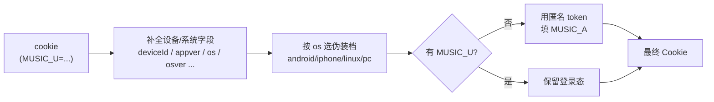

# 运行时状态与身份伪装

要让网易云上游把请求当成正常客户端，光有 `MUSIC_U` 不够，还需要设备号、系统伪装串、来源 IP、匿名 token 这一整套身份。请求层会自动凑齐这些，你通常只需要管登录态。需要精细控制（比如多账号、多身份隔离）时，再按下面的字段介入。

## 运行时状态 `RuntimeState`

进程里维护着一份全局运行时状态：

```ts
interface RuntimeState {
  anonymousToken: string // 匿名 token，未登录时充当身份
  cnIp: string // 伪装的中国来源 IP
  deviceId: string // 伪装的设备号
}
```

进程启动时这份状态会自动初始化：

- `anonymousToken`：尝试从本地临时文件（系统临时目录下的 `anonymous_token`）读取，没有就是空串。
- `cnIp`：随机生成一个中国 IP。
- `deviceId`：随机生成一个设备号。

这意味着**即使什么都不配置，请求也会带上一套可用的伪装身份**。

## Cookie 是怎么被补全的

传进来的 `cookie` 不会被原样发出去。请求层会在它的基础上补全一批字段：



几个要点：

- **设备与系统字段**（`deviceId`、`appver`、`channel`、`os`、`osver` 等）会自动补上，取自运行时状态和系统伪装档。
- **系统伪装档**由 `cookie.os` 决定，可选 `android` / `iphone` / `linux` / `pc`，不传默认 `pc`。每种档位有成套匹配的版本号。
- **未登录时**（没有 `MUSIC_U`），请求层会用匿名 token 填充 `MUSIC_A`，让接口至少以游客身份可用。
- 已经传了的字段不会被覆盖，补全只填空缺。

## 来源 IP 伪装

请求会带上 `X-Forwarded-For` 和 `X-Real-IP`，值按以下优先级确定：

```text
realIP  >  ip  >  运行时 cnIp
```

```ts
// 显式指定来源 IP
await songUrl({ id: '347230' }, { realIP: '116.25.146.177' })
```

- 都不传时，SDK 链路会自动回退到运行时的伪装中国 IP（`cnIp`）。
- 遇到上游区域限制（如 `460`）时，手动传一个国内 `realIP` 往往能解决。
- 这条只影响 SDK 直接调用链路。HTTP 服务链路始终根据请求来源显式传 IP，不受这个默认回退影响。

## 匿名 token 的懒加载

走 SDK 调用时，如果**没有提供任何身份**（既没有带 `MUSIC_U` / `MUSIC_A` 的 cookie，也没有在 `state` 里给 `anonymousToken`），请求层会在首次调用时惰性注册一个匿名 token：

- 用 single-flight 去重：并发的首次调用只会触发一次注册，其余等待复用结果。
- 注册成功后写回运行时状态，后续调用直接复用，不再重复注册。

反过来，只要带了任何有效身份，这个懒加载就不会触发，不会有多余的注册请求。

## 按调用覆盖身份：`state`

需要在单次调用里使用一套独立身份时，用 `state` 字段覆盖运行时状态（`Partial<RuntimeState>`）：

```ts
await songUrl(
  { id: '347230' },
  {
    state: {
      anonymousToken: 'token-for-this-call',
      cnIp: '116.25.146.177',
      deviceId: 'device-for-this-call',
    },
  },
)
```

`state` 按调用合并到全局运行时状态之上，只影响这一次请求，不会污染进程级状态。
这是实现**多身份隔离**的底层手段。如果要的是“自动轮换多套身份”，
用更上层的封装更简单，见 [SDK 缓存与身份池](/guide/sdk-cache-and-identity-pool)。

## 进程级状态是内部细节

运行时状态的读写函数（`getRuntimeState` / `setRuntimeState` 等）属于内部实现，
不在公开 API 里。需要控制身份时，通过 `config` 的 `cookie`、`ip` / `realIP`、
`state` 这些公开字段来做，它们覆盖了绝大多数需求。
