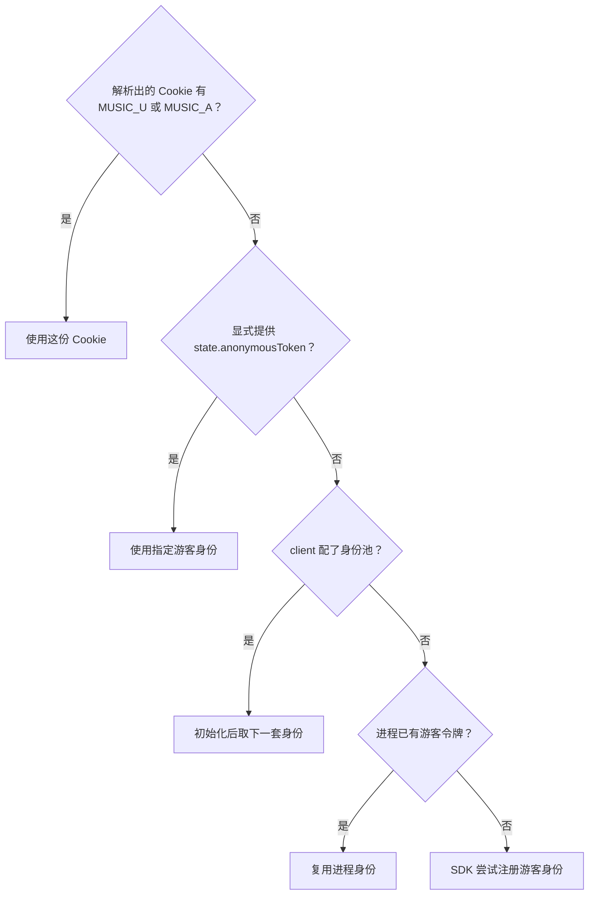

# 运行时状态与身份

登录 Cookie 之外，请求还会带设备号、客户端版本和来源 IP 请求头。库会准备这些协议字段。通常只需传有效 Cookie，需要隔离多账号或测试环境时再按次覆盖。

## 运行时保存什么

```ts
interface RuntimeState {
  anonymousToken: string;
  cnIp: string;
  deviceId: string;
}
```

进程初始化时只生成默认设备号和中国地区 IP 字符串，匿名令牌为空，不读写任何本地文件，因此 SDK 可以直接跑在随时回收的 Serverless 函数里。HTTP 服务的 CLI 启动阶段会另外从令牌文件读取匿名令牌，见 [部署 HTTP 服务](/guide/server-deployment)。

这些值用于构造客户端协议身份，不表示真实设备或真实出口 IP，也不保证上游一定接受请求。

## 这次调用用哪个身份

先解析 Cookie 来源：显式 `config.cookie` 优先，未提供时才读取 `config.headers` 中的 Cookie。请求头名称不区分大小写，两种来源不会逐项合并。


```mermaid
flowchart TD
  COOKIE{"解析出的 Cookie 有 MUSIC_U 或 MUSIC_A？"} -->|是| EXPLICIT["使用这份 Cookie"]
  COOKIE -->|否| STATE{"显式提供 state.anonymousToken？"}
  STATE -->|是| TOKEN["使用指定游客身份"]
  STATE -->|否| POOL{"client 配了身份池？"}
  POOL -->|是| NEXT["初始化后取下一套身份"]
  POOL -->|否| RUNTIME{"进程已有游客令牌？"}
  RUNTIME -->|是| REUSE["复用进程身份"]
  RUNTIME -->|否| REGISTER["SDK 尝试注册游客身份"]
```

这张图描述 SDK 模块调用。HTTP 的 CLI 启动阶段会准备匿名令牌，直接 `createRequest` 则只使用提供的配置和当前运行时状态，不自动触发 SDK 的身份初始化。

身份准备好后，调用保存一份快照。之后进程状态变化，不会中途改掉这次调用的身份。缓存和出口冷却也根据有效身份区分请求。

## Cookie 会怎样整理

请求层按协议补充 `deviceId`、`appver`、`os`、`osver`、`channel` 等字段。`cookie.os` 可选择 `android`、`iphone`、`linux` 或 `pc`，默认使用 `pc` 对应的配置。

多数设备与版本字段会保留显式值，但 Cookie 不是原样透传。请求标识等字段会生成或重写，`api`、`eapi` 还会把协议头中的字段重新整理成 Cookie。因此不能把“所有已有字段都不会被覆盖”当成保证。

没有账号 `MUSIC_U`、也没有游客 `MUSIC_A` 时，若运行时快照中有匿名令牌，就会补入 `MUSIC_A`。

## 来源 IP 请求头

SDK 的来源 IP 按以下顺序选择：

```text
realIP > ip > state.cnIp 或进程 cnIp
```

```ts
import { songUrl } from 'hana-music-api';

const result = await songUrl({ id: '347230' }, { realIP: '116.25.146.177' });
console.log(result.body);
```

它改变的是 `X-Forwarded-For` 和 `X-Real-IP`，不会改变网络出口。需要真实代理时，用 `proxy` 或自定义 `fetcher`。

HTTP 服务根据连接地址和可信代理配置确定来源，不接受客户端传入 `ip` 或 `realIP` 执行配置。无法取得来源或来源是 IPv6 loopback 等情况时，服务可能回退到运行时 IP，详见 [部署 HTTP 服务](/guide/server-deployment)。

## 首次注册怎样等待

SDK 缺少身份时，会让并发的游客初始化共用注册工作。注册成功后更新进程运行时状态，后续可直接复用。SDK 的这次懒初始化只更新内存，CLI 的令牌生成流程才负责文件保存。

初始化等待计入模块总期限。一个等待者取消，不影响仍在等的调用；最后一个等待者也取消时，会中断共享注册。失败后允许后续调用再次尝试。

注册请求也经过同一个请求内核和出口额度。自定义 `fetcher` 会收到注册请求，测试只关注业务接口时，可提供 `MUSIC_A=test-token` 这样的测试身份。

## 按次覆盖运行时状态

```ts
import { songUrl } from 'hana-music-api';

const result = await songUrl(
  { id: '347230' },
  {
    state: {
      anonymousToken: 'token-for-this-call',
      cnIp: '116.25.146.177',
      deviceId: 'device-for-this-call',
    },
  },
);
console.log(result.body);
```

`state` 在本次调用中覆盖进程默认值，不会把这些覆盖值写回全局状态。显式账号 Cookie 仍比游客令牌优先。

运行时读写函数属于内部实现，不从 SDK 根入口导出。自动轮换多套游客身份的用法见 [缓存与身份池](/guide/sdk-cache-and-identity-pool)。
