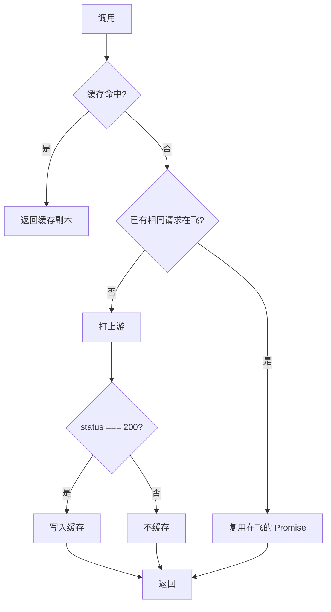
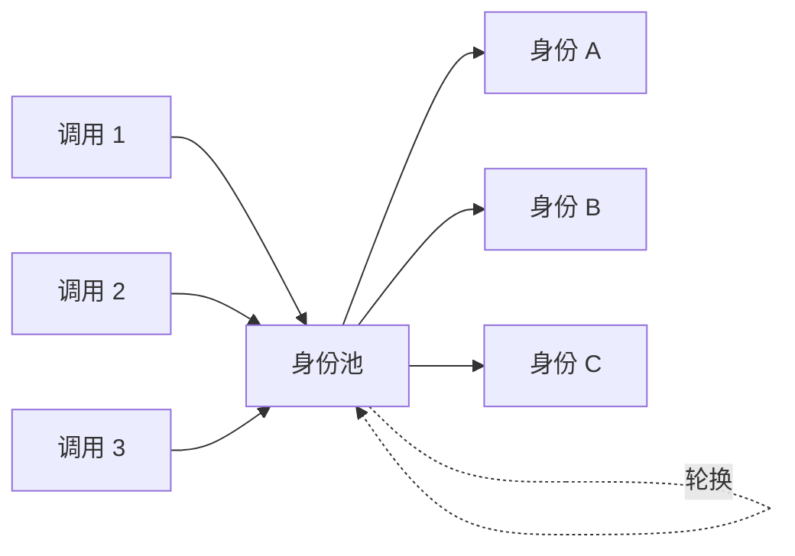

# SDK 缓存与身份池

和前面的单次调用配置不同，这两个能力是**客户端级别**的，需要在创建客户端时配置，且只对 `createHanaMusicApi()` 生效：

```ts
const hana = createHanaMusicApi({
  cache: { ttlMs: 60_000 },
  identityPool: { size: 5 },
})
```

直接导入的模块函数和 `invokeModule()` 不带这两个能力，因为它们没有“客户端”这个承载状态的对象。

## 响应缓存：`cache`

高频调用时，很多请求其实是重复的（同一个歌单、同一个歌曲详情）。开启缓存能把这些重复请求挡在本地。

```ts
const hana = createHanaMusicApi({
  cache: {
    enabled: true, // 默认开启，传 false 关闭
    ttlMs: 120_000, // 缓存有效期，默认 2 分钟
  },
})
```

它做两件事：

1. **响应缓存**：命中的请求直接返回缓存副本，不打上游。
2. **并发去重（single-flight）**：多个完全相同的请求同时发起时，只真正打一次上游，其余等待并共享结果。



几个要点：

- **只缓存成功响应**（`status === 200`）。失败的不会被缓存，下次还能重试。
- **缓存按账号隔离**。缓存 key 由模块标识、`query` 和本次调用的 `cookie` 共同决定，不同账号、不同参数互不串扰。
- 返回的是缓存的**副本**，改它不会影响缓存里的内容。

::: tip 需要强制刷新时
轮询二维码状态、刷新登录态这类接口不该走缓存。给 `query` 加一个变化的时间戳参数即可让缓存 key 每次都不同，从而绕过缓存。
:::

## 匿名身份池：`identityPool`

做大量未登录调用时，所有请求都用同一套匿名身份（同一个设备号、同一个 IP、同一个匿名 token）容易被上游识别和限流。身份池让预先注册多套匿名身份，调用时轮换使用。

```ts
const hana = createHanaMusicApi({
  identityPool: { size: 5 },
})
```

工作方式：

- 首次调用时惰性注册 `size` 套匿名身份，每套都有自己独立的设备号、伪装 IP 和匿名 token。
- 之后每次调用按轮询（round-robin）取下一套身份。
- 注册失败（瞬态网络错误）时会重置状态，允许后续调用重新尝试，不会让池永久不可用。



::: warning 身份池是为匿名流量设计的
轮换出来的匿名身份会覆盖本次调用的 `cookie` / `ip` / `state`。
所以**不要把身份池和按调用传登录 Cookie 混用**，`MUSIC_U` 会被匿名身份顶掉。
需要登录态时，走普通的 `cookie` 配置，不要开 `identityPool`。
:::

## 怎么组合

| 场景 | 建议 |
| --- | --- |
| 高频读取公开数据 | `cache` + `identityPool` |
| 高频读取，但要登录态 | 只用 `cache`，`cookie` 走客户端配置 |
| 偶发调用 | 都不用，保持简单 |
| 需要每次都拿最新结果 | 不用 `cache`，或用时间戳绕过 |

缓存和身份池都是可选增强，默认关闭，按需打开。不确定要不要用时，先不用。
