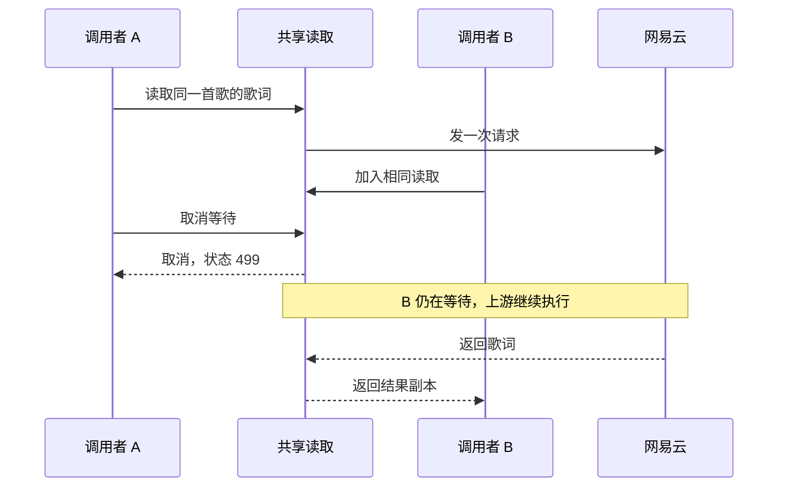

# SDK 缓存与身份池

同一份数据可能被多个地方同时请求。库可以让它们共用一次上游执行，也可以把完成后的结果保存一段时间。这是两件不同的事。

## 缓存和同时请求合并

| 行为         | 什么时候发生                               | SDK 默认设置               |
| ------------ | ------------------------------------------ | -------------------------- |
| 同时请求合并 | 相同读取还没完成，后来的调用加入等待       | 对明确读接口启用           |
| 响应缓存     | 读取已经完成，后来的调用直接复用未过期结果 | 关闭，需要在 client 上开启 |

两种行为目前都只用于 `search`、`lyric`、`song_detail`、`playlist_detail`。登录、写入、轮询、批量、上传和未分类模块每次独立执行。

```ts
import { createHanaMusicApi } from 'hana-music-api';

const hana = createHanaMusicApi({
  cookie: 'MUSIC_U=your-cookie',
  cache: { ttlMs: 120_000 },
});

const first = await hana.search({ keywords: '海阔天空' });
const second = await hana.search({ keywords: '海阔天空' });

console.log(first.body, second.body);
```

只要结果符合缓存条件，第二次调用就可使用缓存。仅 `status === 200`，且存在的 `body.code` 也为 `200` 时才会保存结果。返回给调用者的是副本，修改它不会改掉其他调用者拿到的对象。

传入 `cache: { enabled: false }` 可关闭 client 的结果缓存。关闭后，相同请求在同时执行期间仍能合并；前一次完成后再调用，就会重新发请求。

## 哪些调用能共享

每个 client 都有自己的读取状态，同一 client 的方法共用它。不同 client 不共享结果缓存。具名函数各自保留调用上下文，`invokeModule` 也复用自己的上下文，它们支持范围内的同时读取合并，但默认不保存已完成结果。

HTTP 服务每个实例有独立缓存，默认保存 120 秒。它不会与某个 SDK client 共用缓存。

缓存键包括解码后的业务参数、有效身份、目标与协议配置、请求头，以及请求实现的标识。账号不同、配置不同，结果就不能随意共用。条目受有效期和内部数量上限限制。

`timestamp` 不是通用刷新开关。比如搜索只保留自己声明的参数，添加或改变 `timestamp` 不会改变解码后的查询。需要始终读取新结果时，使用关闭缓存的 client；库没有公开的按次强制刷新字段。

## 共享读取的取消

两个相同的请求同时进来时，库只向网易云发一次请求。第一个调用者取消后，第二个仍然可以继续等待。所有调用者都取消后，库才会停止这次上游请求。


```mermaid
sequenceDiagram
  participant First as 调用者 A
  participant Store as 共享读取
  participant Second as 调用者 B
  participant Upstream as 网易云
  First->>Store: 读取同一首歌的歌词
  Store->>Upstream: 发一次请求
  Second->>Store: 加入相同读取
  First->>Store: 取消等待
  Store-->>First: 取消，状态 499
  Note over Store,Upstream: B 仍在等待，上游继续执行
  Upstream-->>Store: 返回歌词
  Store-->>Second: 返回结果副本
```

超时也按调用者分别计算。A 的期限较短，不会让 B 的等待一起提前结束。内部如何管理共享任务见 [架构详解](/guide/request-layer-overview)。

## 多套游客身份按次轮换

```ts
import { createHanaMusicApi } from 'hana-music-api';

const hana = createHanaMusicApi({ identityPool: { size: 2 } });
const result = await hana.search({ keywords: '海阔天空' });
console.log(result.body);
```

创建 client 时不会立刻注册。首次需要游客身份时，client 会依次注册两套身份，之后在所有模块调用之间轮换使用。并发的首次调用共用初始化工作，已成功注册的身份会保留，失败部分可在后续调用时重试。

如果本次配置已经提供 `MUSIC_U`、`MUSIC_A` 或 `state.anonymousToken`，就优先使用显式身份，不会被身份池替换。身份不同也会影响读缓存命中。

身份注册同样计入调用总期限，并使用进程出口额度。轮换身份只改变协议身份，不改变实际出口 IP，也不能绕过整个上游域名的冷却。
