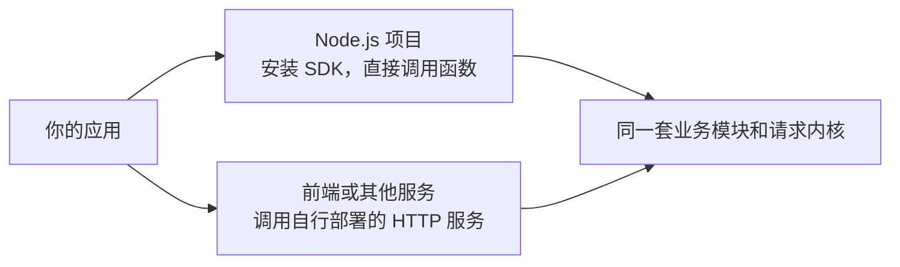

# 什么是 hana-music-api

`hana-music-api` 是第三方网易云音乐 API，提供搜索、歌曲、歌单、登录、上传等 350 多个接口。它沿用 `NeteaseCloudMusicApi` 的接口习惯，用 TypeScript 实现，并用 Effect 管理内部请求流程。

## 选择接入方式

SDK 适合在自己的服务或脚本里调用，要求 Node.js 24 或更高版本和 ESM。HTTP 服务使用 Bun 和 Hono，适合让浏览器或其他语言的服务通过 URL 调用。部署时从仓库源码启动。

两种方式都由请求层处理 Cookie、协议加密、超时和流量控制。SDK 对外仍是 Promise API，不需要先学习 Effect。

## 类型能帮到哪里

每个模块都有本地输入声明，SDK 的具名函数和 client 方法由这些声明生成。已明确建模的接口能提示参数类型，尚未细化的接口仍保留宽松的旧式对象输入。

响应统一包含 `status`、`body`、`cookie`。其中普通 `body` 保留未知 JSON，不承诺所有网易云字段都有完整类型。读取某个字段前，需要按实际结构检查，见 [编程式调用](/guide/programmatic-api)。

## 请求层会替你处理什么

普通调用默认有 8 秒总期限，包含等待、重试和读取完整响应。明确的读接口可以合并同时发生的相同请求，也可以开启短期缓存。写入、登录和上传不会因为开启读缓存而自动复用结果。

这是第三方实现，接口仍可能随网易云变化。来源 IP 请求头、匿名身份和重试策略都不保证绕过上游限制。

从 [快速开始](/guide/getting-started) 发出第一条请求，或阅读 [架构详解](/guide/request-layer-overview) 了解内部怎样执行。
